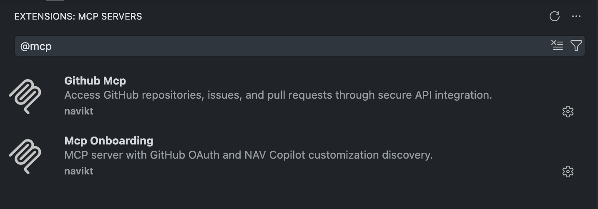

# Nav MCP Onboarding

A reference MCP (Model Context Protocol) server demonstrating GitHub OAuth authentication and NAV Copilot customization discovery for use with GitHub Copilot in VS Code.

## Overview

This server implements:

- **OAuth 2.1 with PKCE** - Secure authentication flow required by MCP spec
- **Dynamic Client Registration (RFC 7591)** - MCP clients register automatically, no manual client_id needed
- **GitHub OAuth proxy** - Acts as OAuth authorization server, proxying to GitHub
- **Organization access control** - Validates user membership in allowed GitHub organizations
- **MCP JSON-RPC** - Full protocol implementation with streamable HTTP transport
- **Customization Discovery** - Browse and install NAV Copilot agents, instructions, prompts, and skills
- **Agent Readiness Assessment** - Check and score a repo's readiness for AI agents
- **Content Generation** - Generate tailored AGENTS.md and copilot-setup-steps.yml from repo analysis

## Getting Started

For installation and usage instructions, see the [main README](../../README.md#mcp-onboarding--agent-readiness--customization-discovery).



## Architecture

```text
┌─────────────────┐     ┌──────────────────────────────┐     ┌─────────────┐
│   VS Code       │────▶│  mcp-onboarding + Discovery │────▶│   GitHub    │
│   (MCP Client)  │◀────│  (OAuth + MCP + Discovery)   │◀────│   OAuth     │
└─────────────────┘     └──────────────────────────────┘     └─────────────┘
```

**Flow:**

1. VS Code discovers OAuth metadata via `/.well-known/oauth-authorization-server`
2. VS Code registers as a client via `POST /register` (Dynamic Client Registration)
3. User is redirected to GitHub for authentication
4. Server exchanges GitHub code for tokens and validates org membership
5. Server issues its own access token mapped to GitHub session
6. VS Code uses token to call MCP tools (both hello-world and discovery)

## Available Tools

### Hello World Tools

| Tool          | Description                                                  |
| ------------- | ------------------------------------------------------------ |
| `hello_world` | Returns a greeting with authenticated user's GitHub username |
| `greet`       | Returns a personalized greeting message                      |
| `whoami`      | Returns information about the authenticated GitHub user      |
| `echo`        | Echoes back a provided message                               |
| `get_time`    | Returns current server time in various formats               |

### Discovery Tools

| Tool                     | Description                                         | Parameters                             |
| ------------------------ | --------------------------------------------------- | -------------------------------------- |
| `search_customizations`  | Search NAV Copilot customizations                   | `query`, `type`, `tags` (all optional) |
| `list_agents`            | List all NAV Copilot agents                         | `category` (optional)                  |
| `list_instructions`      | List all NAV Copilot instructions                   | None                                   |
| `list_prompts`           | List all NAV Copilot prompts                        | None                                   |
| `list_skills`            | List all NAV Copilot skills                         | None                                   |
| `get_installation_guide` | Get installation guide for a specific customization | `type` (required), `name` (required)   |

### Agent Readiness Tools

| Tool                     | Description                                                    | Parameters                                          |
| ------------------------ | -------------------------------------------------------------- | --------------------------------------------------- |
| `check_agent_readiness`  | Assess a repo's agent readiness: customizations + verification | `owner`, `repo` (both required)                     |
| `suggest_customizations` | Suggest NAV Copilot customizations based on repo's tech stack  | `owner`, `repo` (both required)                     |
| `team_readiness`         | Scan a team's repos and produce an agent readiness summary     | `org` (required), `team` or `prefix` (one required) |

### Content Generation Tools

| Tool                   | Description                                                                  | Parameters                      |
| ---------------------- | ---------------------------------------------------------------------------- | ------------------------------- |
| `generate_agents_md`   | Generate a tailored AGENTS.md (cross-agent standard: Copilot, Claude, Codex) | `owner`, `repo` (both required) |
| `generate_setup_steps` | Generate copilot-setup-steps.yml for the Copilot coding agent                | `owner`, `repo` (both required) |

## Configuration

| Environment Variable   | Description                         | Default                 |
| ---------------------- | ----------------------------------- | ----------------------- |
| `PORT`                 | Server port                         | `8080`                  |
| `BASE_URL`             | Public URL for OAuth redirects      | `http://localhost:8080` |
| `GITHUB_CLIENT_ID`     | GitHub OAuth App client ID          | (required)              |
| `GITHUB_CLIENT_SECRET` | GitHub OAuth App client secret      | (required)              |
| `ALLOWED_ORGANIZATION` | GitHub org users must belong to     | `navikt`                |
| `LOG_LEVEL`            | Log level: DEBUG, INFO, WARN, ERROR | `INFO`                  |

## Setup

### 1. Create GitHub OAuth App

1. Go to GitHub → Settings → Developer settings → OAuth Apps
2. Create new OAuth App with:
   - **Homepage URL**: Your server URL
   - **Authorization callback URL**: `{BASE_URL}/oauth/callback`
3. Note the Client ID and generate a Client Secret

### 2. Run Locally

```bash
export GITHUB_CLIENT_ID=your_client_id
export GITHUB_CLIENT_SECRET=your_client_secret
export BASE_URL=http://localhost:8080

mise run dev
```

### 3. Test Endpoints

```bash
curl http://localhost:8080/.well-known/oauth-authorization-server | jq
curl http://localhost:8080/.well-known/oauth-protected-resource | jq

curl http://localhost:8080/mcp
```

## Development

```bash
mise run version    # Generate version string (YYYYMMDD-gitsha)
mise run install    # Download dependencies
mise run generate   # Generate copilot-manifest.json from .github files
mise run check      # Run all checks (fmt, vet, lint, test, generate:check)
mise run test       # Run tests
mise run build      # Build binary to bin/mcp-onboarding
mise run dev        # Run with DEBUG logging
mise run lint       # Run golangci-lint
```

### Generating Customizations Manifest

The customizations manifest is **embedded** into the binary at compile time using Go's `embed` directive. This ensures the manifest is always available and cannot get out of sync with the binary.

**Generating the manifest:**
```bash
mise generate    # or: go run ./cmd/generate-manifest
```

This creates `internal/discovery/copilot-manifest.json` which is embedded into the binary.

**CI Check**: The `mise check` command includes `generate:check` which fails if the manifest is out of date. This ensures the embedded manifest stays synchronized with the `.github` files.

Always run `mise run generate` after adding or modifying agent, instruction, prompt, or skill files.

## Deployment

Automatic deployment via GitHub Actions on merge to main and pull requests.

- **Production**: `https://mcp-onboarding.nav.no`
- **Development**: `https://mcp-onboarding.intern.dev.nav.no`

Deployed to Nais using the reusable `mise-build-deploy-nais` workflow.

## API Endpoints

| Endpoint                                  | Method | Description                            |
| ----------------------------------------- | ------ | -------------------------------------- |
| `/.well-known/oauth-authorization-server` | GET    | OAuth server metadata                  |
| `/.well-known/oauth-protected-resource`   | GET    | Protected resource metadata            |
| `/register`                               | POST   | Dynamic Client Registration (RFC 7591) |
| `/oauth/authorize`                        | GET    | Start OAuth flow                       |
| `/oauth/callback`                         | GET    | GitHub OAuth callback                  |
| `/oauth/token`                            | POST   | Token exchange                         |
| `/mcp`                                    | POST   | MCP JSON-RPC endpoint                  |
| `/health`                                 | GET    | Health check                           |
| `/ready`                                  | GET    | Readiness check                        |

## MCP Registry

This server is registered in Nav's MCP registry:

- **Server Name**: `io.github.navikt/mcp-onboarding`
- **Version**: 2.0.0
- **Capabilities**: OAuth 2.1, Hello World tools, NAV Copilot customization discovery

## Client Compatibility

### VS Code — Fully Supported

MCP registry browse and one-click install works. OAuth with DCR triggers automatically.
Streamable HTTP transport fully supported.

- **Registry**: Click `@mcp` in Copilot Chat → browse → install
- **Auth flow**: DCR → authorize → GitHub login → token exchange (all automatic)
- **Transport**: Streamable HTTP (`POST /mcp`)

### JetBrains (IntelliJ, WebStorm, etc.) — Registry Works, OAuth Unstable

MCP registry browsing and install is available since Copilot for JetBrains plugin v1.5.62.
OAuth authentication for third-party MCP servers has known issues.

- **Registry**: Click the MCP registry icon in Copilot Chat panel → browse → install
- **Status**: Public preview, requires **nightly build** of the Copilot for JetBrains plugin
- **Enhanced OAuth (DCR + fallback)**: [Announced Nov 2025](https://github.blog/changelog/2025-11-18-enhanced-mcp-oauth-support-for-github-copilot-in-jetbrains-eclipse-and-xcode/)
- **Registry + allowlist controls**: [Announced Oct 2025](https://github.blog/changelog/2025-10-28-mcp-registry-and-allowlist-controls-for-copilot-in-jetbrains-eclipse-and-xcode-now-in-public-preview/)
- **Known issues**:
  - [copilot-intellij-feedback#875](https://github.com/microsoft/copilot-intellij-feedback/issues/875) — "No authentication provider found" for custom MCP with DCR
  - [copilot-intellij-feedback#1097](https://github.com/microsoft/copilot-intellij-feedback/issues/1097) — OAuth works with JetBrains AI Assistant but not with Copilot plugin
  - [copilot-intellij-feedback#408](https://github.com/microsoft/copilot-intellij-feedback/issues/408) — Remote MCP servers with OAuth throw 401
  - [copilot-intellij-feedback#978](https://github.com/microsoft/copilot-intellij-feedback/issues/978) — MCP toolset returns empty results, no OAuth login in logs

### Copilot CLI — Not Supported

Copilot CLI (`@github/copilot`) only supports local stdio MCP servers.
No registry support, no remote HTTP transport, no OAuth.

- **Feature request**: [copilot-cli#33](https://github.com/github/copilot-cli/issues/33) — "Support OAuth http MCP servers" (open since Sep 2025)
- **Current capability**: `/mcp add` for local stdio servers only, config in `~/.copilot/mcp-config.json`

### Eclipse — Registry Works, OAuth Untested

MCP registry available in pre-release versions of Copilot for Eclipse.
Same enhanced OAuth support as JetBrains [announced Nov 2025](https://github.blog/changelog/2025-11-18-enhanced-mcp-oauth-support-for-github-copilot-in-jetbrains-eclipse-and-xcode/).
Not tested with this server.

### Xcode — Registry Works, OAuth Untested

MCP registry available in pre-release versions of Copilot for Xcode.
Same enhanced OAuth support as JetBrains [announced Nov 2025](https://github.blog/changelog/2025-11-18-enhanced-mcp-oauth-support-for-github-copilot-in-jetbrains-eclipse-and-xcode/).
Not tested with this server.

## Security

- Uses OAuth 2.1 with PKCE (Proof Key for Code Exchange)
- Dynamic Client Registration for seamless MCP client onboarding
- Redirect URIs restricted to `http://127.0.0.1`, `http://localhost`, or `https://`
- Client registrations rate limited (max 1000) and expire after 30 days
- Validates GitHub organization membership before issuing tokens
- Tokens expire after 1 hour (refresh tokens: 30 days)
- All tokens and client registrations stored in memory (lost on restart)

## License

MIT
