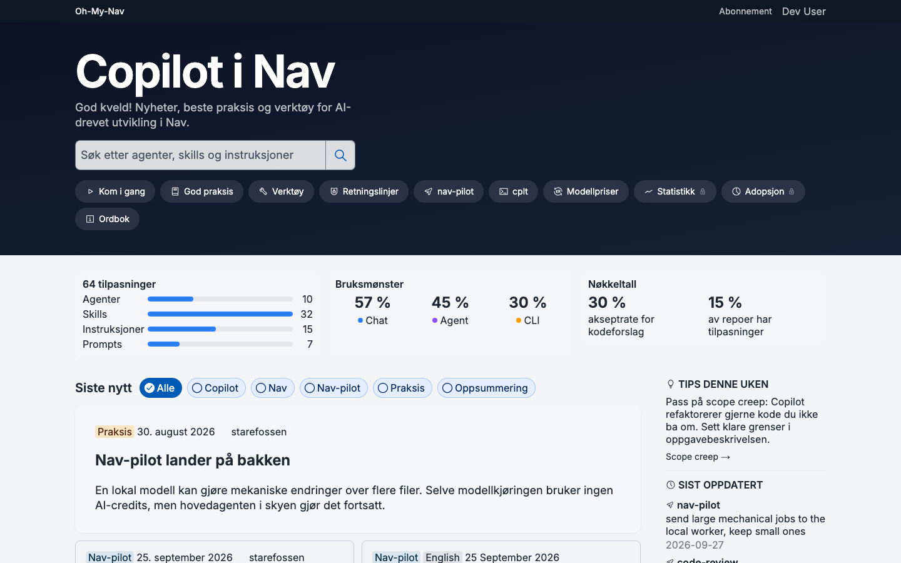
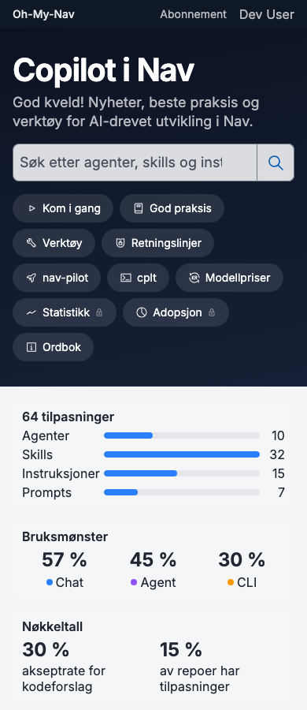
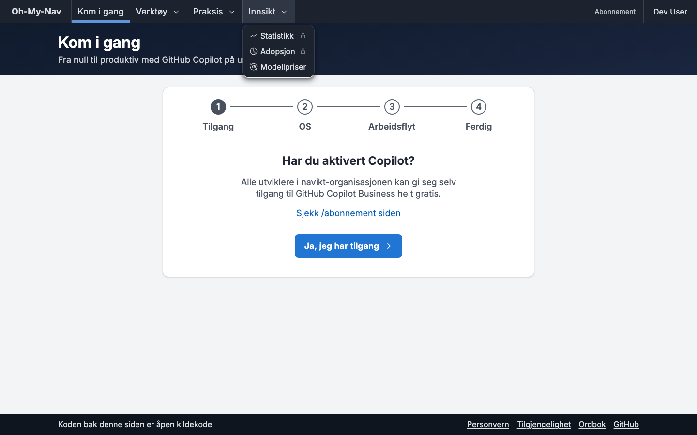
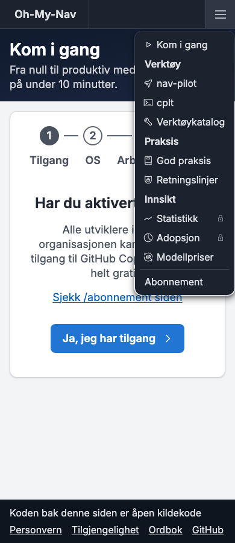
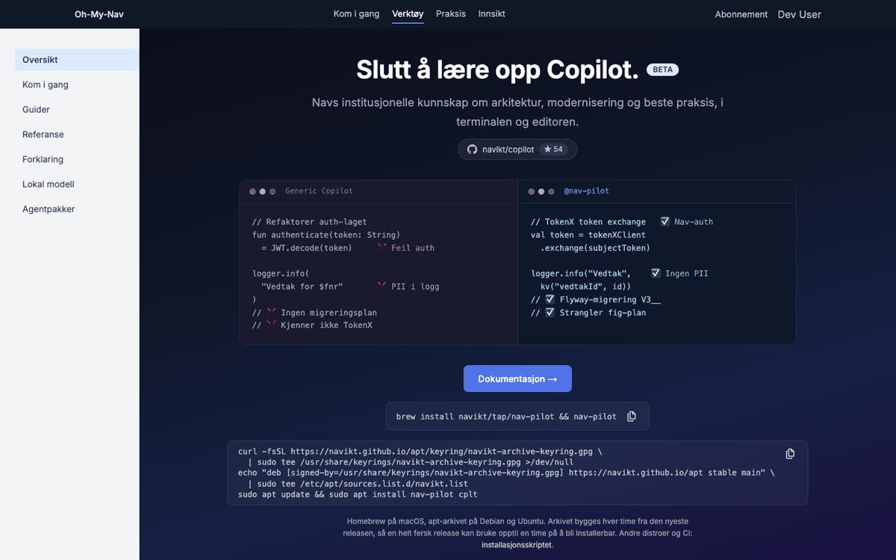
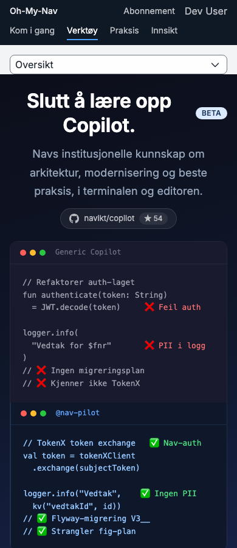

# Forslag: nav-pilot som paraply for ki-utvikling.nav.no

**Status: delvis vedtatt.** V1–V5 ble vedtatt 27.09.2026. Samme kveld kom en ny retning: nav-pilot er paraplyen for alt som handler om Copilot i Nav, og ingen lenker skal brytes. Det endrer tolkningen av V3 og gir fem nye valg (V6–V10) som ikke er tatt. Se [§0](#0-vedtak-og-valg). Arbeidet deles i små PR-er, ett emne om gangen ([§7](#7-plan-for-gjennomføring)).

Hva som er lest på hvilken commit:

- Nettsiden (`apps/my-copilot`), README-ene og Go-koden: `e5083a89` (`main`, 27.09.2026). Nettsiden og README er uendret siden `356c41a4`, der kommandoene ble kjørt mot en binær med tom `HOME`. Linjenumrene i Go-koden er sjekket på nytt på `e5083a89`.
- Klientfunnene i §4 bygger på notater tatt på `d24cac46`.
- Menyprototypen i §6 ligger på grenen `proto/menu` (bygger på `d24cac46`). Den viser V3 slik det ble vedtatt, ikke paraplyen. Nye skisser lages etter at V6–V10 er avgjort.
- Aksel-mønstrene i §6 er lest i kildekoden til aksel.nav.no, navikt/aksel på `3f5153d` [39]–[45]. Andre utviklerportaler er lest på nett 27.09.2026 [60]–[73].

## 0. Vedtak og valg

### Vedtak 27.09.2026

- **V1:** Guider og Forklaring får én side per emnegruppe, med en myk grense på omtrent 400 linjer. Referanse og Klienter får én side hver.
- **V2:** `/nav-pilot/lokal` blir introduksjonen for Mac.
- **V3:** En vanlig `<nav>` i toppfeltet for hele nettstedet, hamburgermeny på mobil, og en seksjonsmeny for nav-pilot. Nedtrekkene bygges som disclosure: en knapp med `aria-expanded` og en liste med lenker ([§6.6](#66-tilgjengelighet)). Eierne av de andre sidene får se skjermbildene i meny-PR-en, og den flettes ikke inn før de har svart.
- **V4:** Valget av standardklient hører til #1022. Klientsiden viser paritetsstatusen derfra.
- **V5:** pi blir værende, merket «eksperimentell», med en liste over det som mangler.

### Hva som er endret, og hvorfor

Brukerne ser nav-pilot som paraplyen for alt Copilot-relatert i Nav, og det er riktig. V3 hadde nav-pilot som ett av tre menypunkter under «Verktøy», ved siden av cplt og verktøykatalogen. Det er motsatt av hvordan brukerne tenker. Derfor:

1. **Gruppene i V3 byttes ut.** nav-pilot blir inngangen. Kom i gang, verktøykatalogen, agentpakkene og cplt ligger under eller ved siden av den ([§1.1](#11-hva-paraplyen-dekker)).
2. **Seksjonsmenyen dekker hele paraplyen**, ikke bare `/nav-pilot/*`. `/kom-i-gang`, `/verktoy` og `/cplt` får samme seksjonsmeny som nav-pilot-sidene.
3. **Ingen URL-er utenfor `/nav-pilot/docs` flyttes.** Hierarkiet vises med meny, seksjonsmeny og en linje over sidetittelen. Aksel gjør det samme: `/komponenter`, `/grunnleggende` og `/monster-maler` ligger på toppnivå, men menyen viser dem som «Designsystemet» [40][42].
4. **Ny regel: lenker brytes aldri** ([§2](#2-lenker-brytes-aldri)). Det er et krav til hver PR, ikke et valg.
5. **Aksel er forbildet for navigasjonen.** Aksel er hvordan vi bygger det, nav-pilot er hva det er.

V1, V2, V4 og V5 står som før. Fra V3 står den vanlige `<nav>`, hamburgermenyen og seksjonsmenyen. Gruppene og rekkevidden til seksjonsmenyen er nye.

### Valg som trengs

| #   | Valg                        | Anbefaling                                                                                                                                                    | Alternativ                                                                                                                         |
| --- | --------------------------- | ------------------------------------------------------------------------------------------------------------------------------------------------------------- | ---------------------------------------------------------------------------------------------------------------------------------- |
| V6  | Toppmenyen                  | Fem flate lenker uten nedtrekk, som Aksel ([§6.3](#63-toppfeltet)). Nedtrekkene fra V3 trengs ikke når hver gruppe har en oversiktsside eller en seksjonsmeny | Nedtrekk (disclosure) slik V3 ble vedtatt, med de nye gruppene                                                                     |
| V7  | Gruppene i toppmenyen       | G1: Kom i gang · nav-pilot · Tilpasning · Praksis og regler · Innsikt ([§6.2](#62-grupper))                                                                   | G2: nav-pilot · Praksis og regler · Innsikt, pluss en «Kom i gang»-knapp. G3: dagens V3 (Kom i gang · Verktøy · Praksis · Innsikt) |
| V8  | Hvor seksjonsmenyen gjelder | S1: hele paraplyen (Kom i gang, nav-pilot, Tilpasning) med én felles layout i en rutegruppe ([§6.4](#64-seksjonsmenyen))                                      | S2: hele nettstedet. S3: bare `/nav-pilot/*`, som i V3                                                                             |
| V9  | Kom i gang                  | `/kom-i-gang` blir introduksjonen for både Copilot og nav-pilot. Vi lager ikke `/nav-pilot/kom-i-gang` ([§1.3](#13-url-er))                                   | Ny side `/nav-pilot/kom-i-gang` i tillegg, slik V1-tabellen hadde                                                                  |
| V10 | Navnet i toppfeltet         | «nav-pilot» med «Copilot i Nav» under, i stedet for «Oh-My-Nav» ([§6.7](#67-merkevaren))                                                                      | Beholde «Oh-My-Nav». Et nøytralt navn som «KI-utvikling i Nav»                                                                     |

## 1. Informasjonsarkitektur

### 1.1 Hva paraplyen dekker

Nettstedet har 22 ruter med innhold under `(nb)` og to under `(en)`. De står som ti likeverdige piller (`lib/nav-items.ts:21-32`), og nav-pilot er én av dem. Tabellen viser hvor hver rute hører hjemme i paraplyen. Ingen av URL-ene endres.

| Gruppe            | Ruter                                                                                                                     | Merknad                                                                                                           |
| ----------------- | ------------------------------------------------------------------------------------------------------------------------- | ----------------------------------------------------------------------------------------------------------------- |
| Kom i gang        | `/kom-i-gang`                                                                                                             | Siden er allerede veiviseren for nav-pilot, cplt og Copilot CLI (`kom-i-gang/page.tsx`, `InteractiveSetupWizard`) |
| nav-pilot         | `/nav-pilot`, `/nav-pilot/lokal` og undersidene, de nye Diátaxis-sidene (§1.3), `/cplt`                                   | cplt er et eget verktøy, men nav-pilot starter klientene i den                                                    |
| Tilpasning        | `/verktoy` (agenter, instruksjoner, skills, prompts, MCP), `/nav-pilot/agentpakker`                                       | `/verktoy?item=<id>` er en egen dyplenke med egen tittel (`verktoy/page.tsx:20-46`)                               |
| Praksis og regler | `/praksis`, `/praksis/guide/<slug>`, `/retningslinjer`                                                                    | Praksis har egen navigasjon (`praksis-hub.tsx`)                                                                   |
| Innsikt           | `/statistikk` (lås), `/adopsjon` (lås), `/kostnad`, `/priser`, ny oversiktsside `/innsikt`                                | `/innsikt` er ny, ikke flyttet. Den trengs fordi gruppen ellers ikke har noe sted å lenke til                     |
| Ved siden av      | `/` (nyheter), `/nyheter/<slug>`, `/videos/<id>`, `/en/news`, `/abonnement`, `/ordbok`, `/personvern`, `/tilgjengelighet` | Forsiden er nyhetsstrømmen. Abonnement ligger i toppfeltet, Ordbok og de engelske sidene i bunnteksten            |

Forsiden blir stående som den er. Den har allerede kort til Kom i gang og God praksis, og den er navet brukerne kommer inn gjennom [71].

### 1.2 Problemet i dag

- `/nav-pilot/docs` er 3297 linjer og 55 ankere på én side. Introduksjon, oppskrifter, oppslagstabeller og bakgrunn står om hverandre. «Kom i gang» (`#kom-i-gang`) kommer for eksempel etter sikkerhetsbakgrunnen (`#isolasjon-er-pakrevd`).
- Den lokale modellen er beskrevet på tre steder: `/nav-pilot/lokal`, `/nav-pilot/docs#lokal-modell` og README. Oppskriftene er ulike (H6 i §5.2).
- `/nav-pilot/lokal` er en landingsside (#994) med målte tall midt i. Den er ikke en guide du kan følge.
- Sider uten `PageHero` har ingen meny. `/nav-pilot` og alle de nye sidene er blant dem.
- Det finnes to «Kom i gang»: `/kom-i-gang` og overskriften på `/nav-pilot` (linje 1011). Begge handler om å installere nav-pilot.

[Diátaxis](https://diataxis.fr/) deler dokumentasjon i fire typer etter hva leseren trenger [61]. GitHub Docs deler Copilot-dokumentasjonen på samme måte (Get started, Concepts, How-tos, Reference, Tutorials), uten å nevne Diátaxis [63]. Cloudflare og Canonical bruker Diátaxis direkte [61][55].

| Type                    | Leseren               | Form                                                      |
| ----------------------- | --------------------- | --------------------------------------------------------- |
| Introduksjon (tutorial) | lærer, er ny          | én vei fra start til mål, alle steg, ingen valg underveis |
| Guide (how-to)          | skal få gjort én ting | kort oppskrift, forutsetter at du kan det grunnleggende   |
| Referanse               | slår opp              | tabeller, fullstendig, gjerne generert fra koden          |
| Forklaring              | vil forstå            | hvorfor, avveininger, målinger                            |

### 1.3 URL-er

Vedtak (V1): Referanse og Klienter får én side hver, fordi leseren søker på siden. Guider og Forklaring får én side per emnegruppe, med en myk grense på omtrent 400 linjer JSX. Uten grensen får `/nav-pilot/guider` rundt 1030 linjer og `/nav-pilot/forklaring` rundt 1000, og da har vi to sider med de samme problemene som i dag. Linjetallene er talt fra dagens `docs/page.tsx` og er grove.

Anbefaling (V9): `/kom-i-gang` er allerede veiviseren for nav-pilot. En ny `/nav-pilot/kom-i-gang` ville gitt to sider med samme jobb. Vi skriver om `/kom-i-gang` etter §5.1 og lar den være introduksjonen for hele paraplyen. De lokale introduksjonene legges under `/nav-pilot/lokal`, som finnes fra før.

| URL                                          | Type          | Innhold                                                                                                | Omtrent linjer |
| -------------------------------------------- | ------------- | ------------------------------------------------------------------------------------------------------ | -------------- |
| `/kom-i-gang`                                | introduksjon  | «Kom i gang med Copilot og nav-pilot», se §5.1. Omskrevet                                              | 250            |
| `/nav-pilot`                                 | oversikt      | landingssiden. «Kom i gang»-blokken (linje 1011) lenker til `/kom-i-gang`                              | –              |
| `/nav-pilot/lokal`                           | introduksjon  | Kom i gang med lokal modell på Mac, se §3. Omskrevet                                                   | 250            |
| `/nav-pilot/lokal/egen-server`               | introduksjon  | Kom i gang med egen server (Linux, Ollama, llama-server)                                               | ny             |
| `/nav-pilot/lokal/decide`                    | introduksjon  | Din første decide-hook                                                                                 | ny             |
| `/nav-pilot/guider`                          | guider        | oversikt, bare lenker                                                                                  | kort           |
| `/nav-pilot/guider/installere-og-oppgradere` | guide         | velge installasjonssted, vanlige oppgaver, installere i CI, oppgradere, avinstallere                   | 250            |
| `/nav-pilot/guider/tilpasse`                 | guide         | endre innstillinger, teamets egne instruksjoner, overstyre og ignorere komponenter, slå hooks av og på | 340            |
| `/nav-pilot/guider/synkronisere`             | guide         | synkronisering og spørsmål om den                                                                      | 220            |
| `/nav-pilot/guider/lokal`                    | guide         | utsending, bytte modell (sky og lokal), decide-oppskrifter                                             | 250            |
| `/nav-pilot/guider/feilsoking`               | guide         | `doctor`, logging av blokkeringer, feilsøking for lokal modell                                         | 120            |
| `/nav-pilot/referanse`                       | referanse     | kommandoer, konfignøkler, nivåer, avslutningskoder, telemetri, lokale modeller, filstruktur            | 500            |
| `/nav-pilot/klienter`                        | referanse     | klientstøtte, se §4                                                                                    | 300            |
| `/nav-pilot/forklaring`                      | forklaring    | oversikt, bare lenker                                                                                  | kort           |
| `/nav-pilot/forklaring/planlegging`          | forklaring    | planleggingsmetodikken                                                                                 | 270            |
| `/nav-pilot/forklaring/sandkassen`           | forklaring    | sandkassen og sikkerhetsnivåene                                                                        | 145            |
| `/nav-pilot/forklaring/lokal-modell`         | forklaring    | hvorfor utsending er begrenset, målte grenser, hva som kommer                                          | 300            |
| `/nav-pilot/forklaring/personvern`           | forklaring    | personvern og telemetri                                                                                | 95             |
| `/nav-pilot/forklaring/arkitektur`           | forklaring    | hvorfor nav-pilot, hva nav-pilot vet, arkitektur og designprinsipper                                   | 230            |
| `/nav-pilot/agentpakker`                     | uendret       | håndboka for pakkeforfattere. Får lenker inn fra guider og referanse                                   | –              |
| `/innsikt`                                   | oversikt      | fire kort: Statistikk (lås), Adopsjon (lås), Kostnad, Modellpriser                                     | kort           |
| `/nav-pilot/docs`                            | videresending | 308 til `/nav-pilot/referanse`. Gamle ankere sendes videre (§2)                                        | –              |

Det blir 14 nye sider, tre korte oversiktssider og to omskrevne. Blir en side lengre enn grensen, deler vi den.

### 1.4 Hvor alt flytter

Tabellene dekker hvert anker på `/nav-pilot/docs` (55: 54 i `DOC_SECTIONS`, linje 84–192, og `lokal-modeller`, som bare finnes i JSX), `/nav-pilot/lokal` (9) og `/nav-pilot` (ingen ankere, bare overskrifter). Hvert gammelt anker blir én oppføring i tabellen over gamle ankere (§2.2).

**`/nav-pilot/docs`**

| Gammelt anker                                                                                                                               | Ny plass                                                                                                        | Type                  |
| ------------------------------------------------------------------------------------------------------------------------------------------- | --------------------------------------------------------------------------------------------------------------- | --------------------- |
| `introduksjon`, `hva-er-nav-pilot`                                                                                                          | `/kom-i-gang#hva-er-nav-pilot`                                                                                  | introduksjon          |
| `isolasjon-er-pakrevd`                                                                                                                      | `/nav-pilot/forklaring/sandkassen`                                                                              | forklaring            |
| `cplt-sikkerhetsniva`, `nar-strict-ikke-anbefales`                                                                                          | `/nav-pilot/forklaring/sandkassen#sikkerhetsniva` (hvorfor) og `/nav-pilot/referanse#sikkerhetsniva` (tabellen) | forklaring, referanse |
| `logging-av-blokkeringer`                                                                                                                   | `/nav-pilot/guider/feilsoking#blokkeringer`                                                                     | guide                 |
| `hvorfor-nav-pilot`, `hva-nav-pilot-vet`                                                                                                    | `/nav-pilot/forklaring/arkitektur#hvorfor`                                                                      | forklaring            |
| `kom-i-gang`, `installasjon`                                                                                                                | `/kom-i-gang`                                                                                                   | introduksjon          |
| `hvor-installere`                                                                                                                           | `/nav-pilot/guider/installere-og-oppgradere#velg-installasjonssted`                                             | guide                 |
| `vanlige-oppgaver`                                                                                                                          | `/nav-pilot/guider/installere-og-oppgradere#vanlige-oppgaver`                                                   | guide                 |
| `klienter-og-konfig`, `stotte-klienter`, `opencode`                                                                                         | `/nav-pilot/klienter`                                                                                           | referanse             |
| `konfigurasjon`                                                                                                                             | `/nav-pilot/guider/tilpasse#endre-innstillinger`                                                                | guide                 |
| `konfig-nokler`                                                                                                                             | `/nav-pilot/referanse#konfignokler` (generert fra `configKeyDefs`, som i dag)                                   | referanse             |
| `personvern`                                                                                                                                | `/nav-pilot/forklaring/personvern` og `/nav-pilot/referanse#telemetri`                                          | forklaring, referanse |
| `collections`                                                                                                                               | `/nav-pilot/agentpakker#pakkene-som-finnes`                                                                     | referanse             |
| `planning-skills`, `planleggingspipelinen`, `fire-faser`, `skills-i-detalj`, `kompetansebevaring`, `gronn-rod-sone`, `demo-i-praksis`       | `/nav-pilot/forklaring/planlegging` (underankerne beholder navnet)                                              | forklaring            |
| `sync-og-oppdatering`, `automatisk-sync`, `lokal-sync`, `tilpasse-sync`                                                                     | `/nav-pilot/guider/synkronisere` (underankerne beholder navnet)                                                 | guide                 |
| `sync-faq`                                                                                                                                  | `/nav-pilot/guider/synkronisere#faq`                                                                            | guide                 |
| `tilpasning`, `team-egne-instruksjoner`, `prosjektkontekst-med-nav-pilot-init`, `overstyre-installerte-filer`, `ignorere-enkeltkomponenter` | `/nav-pilot/guider/tilpasse` (underankerne beholder navnet)                                                     | guide                 |
| `lokal-modell`                                                                                                                              | `/nav-pilot/lokal`                                                                                              | introduksjon          |
| `lokal-kom-i-gang`                                                                                                                          | `/nav-pilot/lokal#installer`                                                                                    | introduksjon          |
| `lokal-modeller` (finnes i koden, ikke i innholdsfortegnelsen, lenket 3 ganger)                                                             | `/nav-pilot/referanse#lokale-modeller`                                                                          | referanse             |
| `lokal-egen-server`                                                                                                                         | `/nav-pilot/lokal/egen-server`                                                                                  | introduksjon          |
| `lokal-utsending`                                                                                                                           | `/nav-pilot/guider/lokal#utsending` (hvordan) og `/nav-pilot/forklaring/lokal-modell#utsending` (hvorfor)       | guide, forklaring     |
| `lokal-hva-den-klarer`                                                                                                                      | `/nav-pilot/forklaring/lokal-modell#malte-grenser`                                                              | forklaring            |
| `lokal-decide`                                                                                                                              | `/nav-pilot/lokal/decide`                                                                                       | introduksjon          |
| `lokal-decide-oppskrifter`                                                                                                                  | `/nav-pilot/guider/lokal#decide-oppskrifter`                                                                    | guide                 |
| `lokal-feilsoking`                                                                                                                          | `/nav-pilot/guider/feilsoking#lokal`                                                                            | guide                 |
| `cli-referanse`, `kommandooversikt`                                                                                                         | `/nav-pilot/referanse#kommandoer`                                                                               | referanse             |
| `installer-cli`                                                                                                                             | `/kom-i-gang#installer`                                                                                         | introduksjon          |
| `oppgrader-cli`                                                                                                                             | `/nav-pilot/guider/installere-og-oppgradere#oppgradere`                                                         | guide                 |
| `slik-fungerer-det`, `filstruktur`                                                                                                          | `/nav-pilot/referanse#filstruktur`                                                                              | referanse             |
| `ressurser`, `lenker`                                                                                                                       | bunnen av hver side. Tabellen sender dem til `/nav-pilot/referanse#lenker`                                      | –                     |
| `arkitektur`, `designprinsipper`                                                                                                            | `/nav-pilot/forklaring/arkitektur`                                                                              | forklaring            |

**Nye guider som ikke finnes i dag.** Disse oppgavene står spredt i README, i `--help` eller ingen steder:

| Nytt anker                                                   | Innhold                                                                                                                           |
| ------------------------------------------------------------ | --------------------------------------------------------------------------------------------------------------------------------- |
| `/nav-pilot/guider/lokal#bytte-modell`                       | bytte skymodell: `nav-pilot models`, `nav-pilot config set model <id>`                                                            |
| `/nav-pilot/guider/lokal#bytte-lokal-modell`                 | `nav-pilot alpha local models`, `nav-pilot alpha local use <key>`, `nav-pilot alpha local init`                                   |
| `/nav-pilot/guider/feilsoking#doctor`                        | `nav-pilot doctor`, `nav-pilot config validate` og `nav-pilot alpha local doctor` (bare for egen server)                          |
| `/nav-pilot/guider/installere-og-oppgradere#avinstallere`    | `uninstall` per omfang, og så binæren, `~/.nav-pilot/` og lokale data (H10)                                                       |
| `/nav-pilot/guider/installere-og-oppgradere#installere-i-ci` | `nav-pilot install <navn> --frozen --force`, og hva kode 3 betyr                                                                  |
| `/nav-pilot/guider/tilpasse#hooks`                           | slå sløyfevakten og maskeringen av og på med `hook_loop_guard`, `hook_redact_secrets`, `hook_redact_fnr` og `hook_injection_note` |

**`/nav-pilot/lokal`** (siden blir introduksjonen, se §3)

| Gammelt anker                           | Ny plass                                                                              |
| --------------------------------------- | ------------------------------------------------------------------------------------- |
| `hva-du-far`                            | innledningen på samme side (kortere)                                                  |
| `kom-i-gang`                            | `#installer` på samme side, med en ekstra `id` (§2.2)                                 |
| `egen-server`                           | `/nav-pilot/lokal/egen-server`                                                        |
| `utsending`                             | `/nav-pilot/forklaring/lokal-modell#utsending` og `/nav-pilot/guider/lokal#utsending` |
| `malt`, `malt-utsending`, `malt-decide` | `/nav-pilot/forklaring/lokal-modell#malte-grenser` (underankerne beholder navnet)     |
| `hva-kommer`                            | `/nav-pilot/forklaring/lokal-modell#hva-kommer`                                       |
| `lenker`                                | bunnen av siden                                                                       |

**`docs/README.nav-pilot.md`**: nettsiden er hoveddokumentasjonen. README beholder installasjon og en lenkeliste. Avsnittet `## Lokal modell (alfa, av som standard)` (linje 478–795, med decide fra linje 701) erstattes av lenker. Ellers glir de tre versjonene fra hverandre igjen.

## 2. Lenker brytes aldri

### 2.1 Regelen

Hver URL eller hvert anker som flytter eller forsvinner, får to ting i samme PR:

1. en permanent videresending i `redirects()` i `next.config.ts`, med `permanent: true`
2. en oppføring i tabellen over gamle ankere, som `components/hash-anchor-scroll.tsx` leser

Interne lenker oppdateres til de nye URL-ene i samme PR. Tabellene er for lenker utenfra: nyhetssaker, README-er i andre repoer, bokmerker og søkemotorer. En CI-sjekk (§2.3) stopper PR-er som bryter regelen.

Nettstedet gjør allerede dette for sju gamle ruter (`next.config.ts:49-62`, for eksempel `/best-practices` til `/praksis`) og for `/ordliste` (`permanentRedirect("/ordbok")`). Aksel har samme ordning: statiske videresendinger i `next.config.ts` og en tabell i CMS-et som `proxy.ts` leser [45]. MDN og GitHub Docs lager videresendingen i samme steg som flyttingen, med verktøy eller en liste i sidehodet, slik at ingen glemmer den [52][53]. NumPy skrev i NEP 44, før de gikk over til Diátaxis, at omleggingen krever at alle lenker skrives om, og spurte brukerne hvilke lenker som ikke måtte brytes [54]. «Cool URIs don't change» [58].

### 2.2 Hvordan

**308, ikke 301.** `permanent: true` gir 308 i Next.js. 308 beholder metoden og innholdet i forespørselen, mens 301 kan gjøre en POST om til GET [46][47]. For en side som bare får GET, virker de likt. Google behandler begge som permanente og flytter indeksen til målet [48]. Nettleseren husker en permanent videresending, så hver oppføring må sjekkes før den flettes inn [46].

**Ankere trenger en tabell i nettleseren.** Nettleseren sender aldri `#anker` til serveren [49]. Serveren kan derfor ikke velge mål etter anker. Nettleseren tar ankeret med til målet for videresendingen [50], men da havner for eksempel `/nav-pilot/docs#lokal-egen-server` på `/nav-pilot/referanse#lokal-egen-server`, som ikke finnes. mkdocs-redirects løser det med et lite skript som leser `location.hash` [51]. Vi gjør det samme i komponenten vi allerede har:

- `HashAnchorScroll` er montert på alle sider fra `site-shell.tsx`. Den leser `location.hash` og prøver igjen til elementet finnes (inntil 120 forsøk med 50 ms mellom, `hash-anchor-scroll.tsx:16,61`).
- Vi legger til én tabell med nøkkelen `sti#anker`, der stien er siden nettleseren lander på etter videresendingen. For `/nav-pilot/docs` er det `/nav-pilot/referanse`. Nøkkelen må ha med stien, fordi samme anker finnes på flere sider (`kom-i-gang` på både `/nav-pilot/docs` og `/nav-pilot/lokal`).
- Finnes ikke `id`-en ved første forsøk, og nøkkelen står i tabellen, kaller komponenten `router.replace(nyUrl)` med en gang. Sidene er rendret på serveren, så en `id` som finnes, er der ved første forsøk.
- Flytter et anker innenfor samme side (`/nav-pilot/lokal#kom-i-gang` til `#installer`), trengs ingen tabell. Et element kan bare ha én `id`, så overskriften pakkes inn i en `<div id="kom-i-gang">` rundt `<h2 id="installer">`.

**Vi flytter ingen ruter utenfor `/nav-pilot/docs`.** Paraplyen kunne vært uttrykt med URL-er som `/nav-pilot/verktoy`. Det lønner seg ikke:

- `/verktoy` har 28 interne lenker og står i `README.md:19,67` på det gamle domenet `min-copilot.ansatt.nav.no`. `/verktoy?item=<id>` er en dyplenke per tilpasning.
- `scripts/generate-docs/main.go:151` lager installasjonslenker til `/install/<type>` i alle de genererte README-ene for agenter, skills, instruksjoner og prompts. De rutene må aldri flytte.
- `/praksis` har 32 interne lenker og en `/praksis/guide/<slug>` per guide. Andre team lenker til sidene fra sine egne repoer, og de lenkene ser vi ikke.
- Aksel viser at det ikke trengs. Rutegruppen `(designsystemet)` gir tre toppnivåruter én felles layout og seksjonsmeny, og menyen markerer «Designsystemet» som aktiv på alle tre [40][42].

Det gamle domenet `min-copilot.ansatt.nav.no` står fortsatt i README-ene og i installasjonslenkene. Om det videresender, er ikke sjekket her, men CI-sjekken må ta det med.

### 2.3 CI-sjekken

Sjekken bygges i en egen PR. Den er et krav for PR-ene med nye sider og for meny-PR-en, og de flettes ikke inn før den er grønn.

- **Oversikt:** alle offentlige ruter og ankere, og alle lenker til nettstedet fra sitemap (`app/sitemap.ts`), interne lenker, nyhetssakene i `docs/news/articles/`, README-ene, andre dokumenter i repoet, CLI-en, installasjonsskriptet og de genererte installasjonslenkene.
- **Enhetstest:** feiler hvis en lenke gir 404, eller hvis målet for et anker ikke finnes som `id` på målsiden. Hver oppføring i tabellen over gamle ankere testes også.
- **Mulig tillegg:** lychee med `--include-fragments` på det bygde nettstedet [56]. linkinator sjekker bare ankere i HTML fra serveren og ser ikke ankere som legges til med JavaScript [57].

## 3. Introduksjon: lokal modell på Mac

`/nav-pilot/lokal` blir en guide med seks steg. Tallene fra målingene (`malt`, `malt-utsending`, `malt-decide`) flyttes til `/nav-pilot/forklaring/lokal-modell#malte-grenser`, og guiden lenker dit én gang. Hjelpeteksten til kommandoene er sjekket mot `356c41a4`.

**Tittel:** Kom i gang med lokal modell på Mac
**Ingress:** Du installerer nav-pilot, laster ned en kodemodell og kjører en første økt der hovedagenten i skyen sender en oppgave til modellen på maskinen din. Det tar omtrent 30 minutter, mest nedlasting.

1. **Sjekk maskinen.** Du trenger Apple Silicon, minst 48 GB minne og omtrent 30 GB ledig disk. Vektene er 25 GB, resten er et Python-miljø. Siden henter tallene fra modellmanifestet (`min_ram_gb`, `weights_gb` i `internal/local/models.json`), slik den gjør i dag. `init` skriver «about 26 GB» fordi den regner med miljøet.
   ```sh
   uname -m                              # arm64
   sysctl -n hw.memsize | awk '{print $1/2^30 " GB"}'
   df -h ~
   ```
   Har du ikke dette, gå til [Kom i gang med egen server](/nav-pilot/lokal/egen-server).
2. **Installer.** Hopp over hvis du har gjort [Kom i gang](/kom-i-gang).
   ```sh
   brew install navikt/tap/nav-pilot navikt/tap/cplt
   brew upgrade navikt/tap/nav-pilot    # har du den fra før
   ```
3. **Sett opp modellen.** `init` viser modellen, hva den krever, hva den laster ned og fra hvilke verter. Så spør den før den starter. Den ber om passordet ditt én gang for å heve minnegrensen i macOS. Når den er ferdig, kjører serveren.
   ```sh
   nav-pilot alpha local init
   nav-pilot alpha local status        # Model, Server og wired limit skal være grønne
   ```
   Etter en omstart av maskinen: `nav-pilot alpha local start`. Den spør før den hever grensen igjen.
4. **Første økt.** Utsending krever opencode som klient.
   ```sh
   nav-pilot config set client opencode
   cd ~/kode/mitt-repo
   nav-pilot
   ```
   Be om en mekanisk endring over flere filer, for eksempel «legg til parameteren `ctx` i alle kall til `hentBruker`». Med standardnivået `balanced` stopper nav-pilot hovedagenten når endringen når fem filer, og ber den sende jobben til `local-worker`. Etterpå viser `nav-pilot alpha local status` hva modellen har gjort. Kjørte ikke serveren, sier nav-pilot fra både før og etter økten at alt gikk i skyen (`opencode_launch.go:1228-1240`).
5. **Første decide.**
   ```sh
   echo "Legg til retry i klienten" | nav-pilot alpha decide \
     "Forklarer commit-meldingen hvorfor endringen ble gjort?" --options yes,no --evidence -
   ```
   Du får en sannsynlighet per svar på under et halvt sekund. Neste steg er [Din første decide-hook](/nav-pilot/lokal/decide).
6. **Hvor du går videre.**
   - Skru utsending opp eller ned: `/nav-pilot/guider/lokal#utsending`
   - Bytt lokal modell: `/nav-pilot/guider/lokal#bytte-lokal-modell`
   - Når noe henger: `/nav-pilot/guider/feilsoking#lokal`
   - Hva modellen klarer, målt: `/nav-pilot/forklaring/lokal-modell#malte-grenser`
   - Skru det av: `nav-pilot alpha local off` (vektene blir liggende) eller `nav-pilot alpha local purge` (sletter dem)

Steg 4 og 5 må kjøres på en ren Mac før siden publiseres, og utdataene limes inn som eksempel. Kommandoene er sjekket mot hjelpeteksten, men selve økten er ikke kjørt i dette arbeidet.

**Kom i gang med egen server** (`/nav-pilot/lokal/egen-server`) følger samme mal, i rekkefølgen fra `nav-pilot alpha local --help`:

1. Start serveren. Oppskriftene for Ollama og llama-server finnes i `EGEN_SERVER` i `lokal/page.tsx`, under `#lokal-egen-server` i `docs/page.tsx` og i README.
2. `nav-pilot alpha local setup` finner serveren og velger modell. Den lagrer `local_endpoint`, `local_endpoint_model` og `local_enabled = true` bare hvis du svarer ja (`alpha_local_setup.go:548-552`).
3. `nav-pilot alpha local init` sjekker serveren og slår den på. Med egen server laster den ikke ned noe.
4. `nav-pilot alpha local doctor` sjekker verktøykall, logprobs, kontekst og tid til første token. Den sjekker bare egen server (`local_endpoint`).
5. `nav-pilot config set client opencode`.
6. Første økt.

Siden merkes «alfa, ikke målt».

**Din første decide-hook** (`/nav-pilot/lokal/decide`): start serveren, lag `scripts/commit-explains-why.sh` (skriptet `COMMIT_EXPLAINS_WHY_HOOK` fra `docs/page.tsx`), kjør `chmod +x` og koble det til som `.git/hooks/commit-msg`. Siden viser pre-commit og lefthook som alternativer. Test med `nav-pilot alpha decide --eval cases.jsonl`. Siden må si hva som skjer når serveren ikke kjører: `decide` svarer med kode 2 (`alpha_decide.go:97`), og hooken slipper commiten gjennom, fordi skriptet alltid avslutter med 0.

## 4. Klientstøtte

Kildene er koden under `cli/nav-pilot/internal/`, PR-ene i tabellen, navikt/copilot#1022 og et nettsøk 27.09.2026 for klientene nav-pilot ikke støtter. Tallene i hakeparentes viser til [Kilder](#kilder).

### 4.1 Klientene nav-pilot støtter

Standard er `copilot` (`cli/config.go:492`). Du velger med `nav-pilot config set client <navn>` eller `--client` per kjøring.

Saken #1022 har allerede en paritetstabell for Copilot CLI og opencode. Tabellen under er et utkast til nettsidens versjon. Den legger til pi og skal holdes i takt med #1022.

|                                                    | Copilot CLI                                                                                                                                                                                                                 | opencode                                                                                                                                                                                     | pi                                                                   |
| -------------------------------------------------- | --------------------------------------------------------------------------------------------------------------------------------------------------------------------------------------------------------------------------- | -------------------------------------------------------------------------------------------------------------------------------------------------------------------------------------------- | -------------------------------------------------------------------- |
| Støttet                                            | Ja, standard                                                                                                                                                                                                                | Ja (#306)                                                                                                                                                                                    | Delvis, «eksperimentell» (#812)                                      |
| cplt-sandkasse                                     | Foretrukket. Finnes ikke cplt, spør nav-pilot i terminalen før den starter `copilot` uten sandkasse. `--no-sandbox` hopper over spørsmålet. Uten terminal og uten flagget starter den ikke (`cli/interactive.go:1056-1095`) | Påkrevd (`provider/provider.go:253-259`). Uten cplt: #1028                                                                                                                                   | Påkrevd (`provider/provider.go:496-502`)                             |
| Agentpakke: agenter                                | `--agent` (`copilot_launch.go:130-157`)                                                                                                                                                                                     | `--agent`, filer i `~/.config/opencode/agents/` (`opencode_launch.go:180-265`). `tools:`-begrensninger følger ikke med (#1026)                                                               | Ingen `--agent`. Personaen blir systemprompt (`pi_launch.go:75-100`) |
| Agentpakke: skills                                 | `NAV_PILOT_SKILLS_DIR` (#859)                                                                                                                                                                                               | `~/.config/opencode/skills/`                                                                                                                                                                 | `--skill <mappe>`                                                    |
| Agentpakke: instruksjoner                          | `.github/` eller `COPILOT_CUSTOM_INSTRUCTIONS_DIRS` (#932)                                                                                                                                                                  | `AGENTS.md`                                                                                                                                                                                  | `AGENTS.md` via `--append-system-prompt`                             |
| Hooks (sløyfevakt, maskering)                      | Ja, begge, på som standard (#939, #940, #991, #953)                                                                                                                                                                         | Nei. nav-pilot skriver hooks bare for Copilot (`cli/hook_cmd.go:248`). opencode kan ha plugins [37], og dispatch-gaten (`nav-pilot-dispatch-gate.js`) er allerede en. Portering: #1025, #709 | Nei                                                                  |
| MCP                                                | Klientens eget oppsett. nav-pilot skriver ikke MCP-konfig (#826)                                                                                                                                                            | Samme. MCP-allowlist: #1027                                                                                                                                                                  | Samme                                                                |
| Deling av økter                                    | –                                                                                                                                                                                                                           | Av som standard. nav-pilot setter `share` til `"disabled"` når `opencode.json` ikke sier noe (#1030)                                                                                         | –                                                                    |
| Lokal utsending (`local-worker`, `local_dispatch`) | Nei. En lokal modell tar hele økten (#483). Venter på github/copilot-cli#4703, som fortsatt er åpen uten svar fra GitHub [59]                                                                                               | Ja, eneste klient (#996, #999)                                                                                                                                                               | Nei                                                                  |
| `local_endpoint` (egen server)                     | Ja, hele økten (#998, #1000)                                                                                                                                                                                                | Ja                                                                                                                                                                                           | Nei                                                                  |
| Innlogging med Copilot-abonnementet                | Ja (`copilot_auth_mode`, #424)                                                                                                                                                                                              | Ja. GitHub har støttet det offisielt siden 16.01.2026 [36]                                                                                                                                   | Sannsynlig via pis egen `github-copilot`-leverandør. Ikke verifisert |
| macOS / Linux                                      | Ja / ja. Ingen Windows-bygg (`release-nav-pilot.yaml:62-69`)                                                                                                                                                                | Ja / ja                                                                                                                                                                                      | Ja / ja                                                              |
| Lokal server som nav-pilot styrer                  | Bare Apple Silicon (`local/runtime.go:429-435`). På Linux: egen server                                                                                                                                                      | Samme                                                                                                                                                                                        | –                                                                    |

Tabellen må si tydelig at **en opencode- eller pi-økt mot skyen har verken sløyfevakt eller maskering av hemmeligheter og fødselsnummer.** I dag står det bare indirekte i README.

### 4.2 Andre klienter

«?» betyr at vi ikke har bekreftet det.

| Klient             | Copilot-abonnement                                            | Lokal / OpenAI-kompatibel    | Underagent på annen modell                                | Hooks                                      | MCP      | Lisens                        | cplt i dag                                   |
| ------------------ | ------------------------------------------------------------- | ---------------------------- | --------------------------------------------------------- | ------------------------------------------ | -------- | ----------------------------- | -------------------------------------------- |
| Claude Code        | Bare via proxy (brudd på vilkår, fare for utestenging) [4][5] | Via `ANTHROPIC_BASE_URL` [1] | Annen modell ja, annen leverandør nei [2][3]              | Ja, men de kjører ikke i underagenter [38] | Ja       | Proprietær                    | Ja                                           |
| Codex CLI          | Nei [6]                                                       | Ja [6]                       | Ja, men sperret med ChatGPT-innlogging [7]                | Ja                                         | Ja       | Apache-2.0 [8]                | Nei                                          |
| Goose              | **Ja, innebygd** [9]                                          | Ja [13]                      | **Ja, annen leverandør** (`GOOSE_SUBAGENT_PROVIDER`) [10] | Ja [11]                                    | Ja       | Apache-2.0                    | **Ja**                                       |
| Gemini CLI         | Nei                                                           | Nei [16]                     | Bare Gemini [14]                                          | Ja [15]                                    | Ja       | Apache-2.0                    | Ja                                           |
| Qwen Code          | Nei                                                           | Ja [17]                      | Ja, annen leverandør [18]                                 | Ja [17]                                    | Ja       | Apache-2.0                    | Nei                                          |
| Aider              | Ja, ifølge dokumentasjonen [19]                               | Ja                           | Nei                                                       | Nei                                        | Nei [20] | Apache-2.0                    | Nei (lite aktivitet siden august 2025?) [21] |
| Cline              | Bare i VS Code, ikke i CLI-en [22][23]                        | Ja                           | Bare lesende [24]                                         | Ja [25]                                    | Ja       | Apache-2.0                    | Nei (IDE først)                              |
| Kilo Code          | ? i CLI-en [26][27]                                           | Ja                           | ?                                                         | ?                                          | Ja       | MIT                           | Nei (CLI-en er en opencode-fork)             |
| Crush              | ? [29][30]                                                    | Ja [28]                      | ?                                                         | Foreløpig [28]                             | Ja       | FSL-1.1 (ikke åpen kildekode) | Nei                                          |
| Zed                | Ja [31]                                                       | Ja [31]                      | Ja, egen modell ?                                         | Nei [32]                                   | Ja       | GPL-3.0                       | Nei (editor)                                 |
| Roo Code, Continue | –                                                             | –                            | –                                                         | –                                          | –        | Apache-2.0                    | Lagt ned i 2026 [33][34][35]                 |

cplt-kolonnen er fra `cplt --help` (versjon 2026.09.24).

### 4.3 Grunnlaget for V4

Om opencode skal bli standardklient, avgjøres i navikt/copilot#1022. Saken er åpen. Vedtakene der fra 27.09.2026 er:

1. Lokal worker og dispatch-gate finnes bare i opencode, og det skal stå tydelig i klientinformasjonen på ki-utvikling.
2. Hooks og `tools:`-begrensninger skal porteres til opencode der det går. Der det ikke går, dokumenteres gapet nøyaktig.
3. Eksisterende brukere flyttes ikke. De får et tilbud om opencode.
4. nav-pilot håndhever policy for opencode ved oppstart.
5. Gapet mellom klientene skal lukkes så langt det går.

Paritetsplanen i #1022 er disse sakene:

- #1025: de innebygde hookene og Python-gatene i opencode-økter, som en nav-pilot-plugin
- #709: agentpakke-hooks som opencode-plugin
- #1026: `tools:`-begrensninger som `permission` per agent i opencode
- #1027: policy for opencode (`share`, autoupdate, MCP-allowlist, testet versjonsområde). `share` er løst i #1030
- #1028: opencode uten cplt (`--no-sandbox`, CI) og veiledning for WSL
- #1029: lagre den effektive klienten til eksisterende brukere før standarden endres, og tilbudet om opencode

Det siste punktet i paritetsplanen er at klientsiden på ki-utvikling viser den endelige paritetsstatusen. Det er et krav til klientsiden (PR 7 i §7): `/nav-pilot/klienter` viser status for #1025–#1029 og #709, og oppdateres når sakene lukkes.

Dette forslaget tar ikke stilling til standardklienten. Det legger til:

1. **Innspill til #1022 om lokal utsending.** Hybridrapporten (`reports/2026-09-27-hybrid-orchestration-research/research.md` §4 i mlx-workspace) setter besparelsen til noen cent per jobb med Sonnet 5-priser. Sonnet 5 sendte oppgaver i 1 av 29 kjøringer. Nettsiden beskriver derfor opencode som klienten for lokal utsending, noe du velger selv. Får Copilot CLI underagenter på egen leverandør (github/copilot-cli#4703), faller hovedgrunnen til opencode bort.
2. **Klient nummer fire, hvis noen: Goose.** Den har innebygd Copilot-innlogging og underagenter på en annen leverandør, som er samme form som `local-worker`. Den har også hooks, MCP, skills og `AGENTS.md` [11][12]. Lisensen er Apache-2.0, og cplt kan allerede kjøre den.
3. **Ikke Claude Code, Codex, Gemini CLI eller Qwen Code.** Ingen av dem kan bruke Copilot-abonnementet uten en proxy som bryter vilkårene, og Nav kjøper modelltilgang gjennom Copilot. Det er et lisensvalg, ikke et teknisk: cplt kjører allerede `claude` og `gemini`.
4. **pi (V5).** pi blir værende. Klientsiden merker den «eksperimentell» og lister det som mangler: hooks, utsending, `local_endpoint`, `--agent` og innstillingene som ignoreres med en advarsel (`pi_launch.go:132-156`). En lokal modell-id går til pi som `--model mlx/<id>` (`pi_launch.go:116-125` via `ToOpenCodeModel`, `provider.go:131-132`). Om pi har en `mlx`-leverandør, sjekkes før klientsiden publiseres.

### 4.4 Feil i eksisterende dokumenter

Rettes i klientside-PR-en (PR 7):

- `cli/nav-pilot/DESIGN.md:150` kaller pi en stub. pi er implementert (#812).
- `DESIGN.md:149,170` sier at opencode starter med `opencode run`. Den starter TUI-en.
- `DESIGN.md:84-86` sier at en Copilot-id uten prefiks gir feil i opencode. Koden legger til `github-copilot/` (`provider.go:296-305`).
- `DESIGN.md:156-157` lister klientene cplt støtter (`gemini`, `antigravity`, `shell`). `claude`, `goose` og `dsh` mangler.
- README:881 sier «Alle kjører i cplt-sandkassen». Copilot kan kjøre uten.
- README:343 sier at Copilot-konteksten «Installeres i `.github/`». Med `--user` havner den i `~/.copilot/`.
- README:3 nevner ikke pi.
- `docs/CLIENT-SUPPORT-MATRIX.md` dekker bare GitHubs egne klienter og har ingen rad for hooks. Den bør lenke til `/nav-pilot/klienter`.

## 5. Installasjon og oppstart

### 5.1 Én vei fra null

Dette blir `/kom-i-gang` (V9). Veiviseren (`InteractiveSetupWizard`) blir stående, men siden får stegene under rundt seg, med en kort «Hva er nav-pilot» først. Spørsmålene i veiviseren er sjekket mot koden. Rekkefølgen i steg 4 og det som skjer når cplt starter, er hentet fra notater. Steget må kjøres én gang i et tomt repo før siden publiseres.

1. **Forutsetninger.** Copilot-abonnement ([/abonnement](/abonnement)), tilgang til navikt, Homebrew (Mac) eller apt (Linux), `gh auth login`.
2. **Copilot CLI.** `curl -fsSL https://gh.io/copilot-install | bash`. cplt installerer den ikke.
3. **nav-pilot og cplt.** `brew install navikt/tap/nav-pilot navikt/tap/cplt`. Linux: apt-pakken, eller `scripts/install.sh` hvis du ikke kan bruke apt.
4. **Første kjøring.** `cd <repo> && nav-pilot`. Veiviseren spør om klient, modus, modell, resonneringsnivå og automatisk oppdatering (`cli/config_setup.go:120`, `:134`, `:154`, `:161`, `:180`). Så kommer et varsel om telemetri (`cli/cli.go:1146`) og et spørsmål om rtk (`cli/rtk_setup.go:84`). Deretter velger du agentpakke og om den skal installeres i repoet (`.github/`) eller for deg (`~/.copilot/`). Til slutt starter cplt, som først ber om sin egen bekreftelse, og så Copilot. Utenfor et git-repo tilbys bare installasjon for deg.
5. **Valgfritt: lokal modell** på Mac (`/nav-pilot/lokal`) eller egen server (`/nav-pilot/lokal/egen-server`).

GitHub Docs har «Get started» øverst i Copilot-menyen [62], og GOV.UK Design System har det først i toppmenyen [73]. Begge gir nye brukere én vei inn og legger resten bak.

### 5.2 Hull

| #   | Hull                                                                                                                                                                               | Hvor                                                               | PR  |
| --- | ---------------------------------------------------------------------------------------------------------------------------------------------------------------------------------- | ------------------------------------------------------------------ | --- |
| H1  | Installasjonskommandoen er ulik på hver side. Landingssiden og `/nav-pilot/lokal` har ikke med cplt. `docs#installer-cli` har bare nav-pilot                                       | `nav-pilot/page.tsx:53`, `lokal/page.tsx:44`, `docs/page.tsx:2862` | 2   |
| H2  | Copilot CLI og abonnementet står bare i veiviseren på `/kom-i-gang`. `doctor` sjekker ikke om `copilot` finnes, og start uten gir bare `copilot cli not found`                     | `provider/copilot_launch.go:225`                                   | 1   |
| H3  | Førstegangsveiviseren (fem spørsmål), rtk-spørsmålet og telemetrivarselet er ikke beskrevet noe sted                                                                               | `docs#installasjon`                                                | 3   |
| H4  | Veiviseren på `/kom-i-gang` skriver `export PATH="$HOME/.local/bin:$PATH"` også for brew, og bruker `curl … \| bash` på Linux uten apt. README advarer mot det siste               | `interactive-setup-wizard.tsx:82,91`                               | 3   |
| H5  | Råd om installasjonssted spriker. README sier det kommer an på, `doctor`/`sync`/`list` foreslår `--user`, og veiviseren på nettet bruker `--repo`                                  | `interactive-setup-wizard.tsx:96`                                  | 3   |
| H6  | Lokal oppstart står 3–4 steder med ulike steg. `docs#lokal-kom-i-gang` kjører `init` og så `start`, men `init` starter serveren                                                    | `docs/page.tsx:2229-2231`                                          | 2   |
| H7  | commit-msg-hooken står to steder. README mangler filsti og installasjonssteg, og nettsiden mangler vanlig `.git/hooks`. Ingen sier at hooken slipper alt gjennom når serveren står | README:717-737, `docs#lokal-decide-oppskrifter`                    | 5   |
| H8  | `help <kommando>` viser den globale hjelpen for `doctor`, `env`, `init`, `export`, `feedback`, `validate` og `ignore`. `alpha local setup --help` gir kode 2                       | `cli/help.go`                                                      | 1   |
| H9  | Avslutningskoder står tre steder med ulikt innhold. `docs#kommandooversikt` mangler 3 (`--frozen`) og har to ulike lister over `--json`-kommandoer                                 | `docs/page.tsx:286`, `:3046`                                       | 4   |
| H10 | Avinstallering: `uninstall` fjerner ett omfang om gangen. Hvordan du fjerner binæren, `~/.nav-pilot/` og lokale data, står ingen steder                                            | `docs/page.tsx:279`                                                | 4   |
| H11 | `--local-dispatch` virker, men står ikke i `--help`                                                                                                                                | `cli/cli.go:422`                                                   | 1   |
| H12 | To forskjellige «off»: `config set local_dispatch off` (ingen utsending) og `alpha local off` (ingen lokal modell). `status` skriver «Dispatch off» om det siste                   | –                                                                  | 4   |
| H13 | README lister 11 av 23 telemetrimålinger                                                                                                                                           | README:834-844, `telemetry/telemetry.go:187-287`                   | 4   |
| H14 | Ingen feilsøking for sudo og minnegrense ved `start`                                                                                                                               | `docs#lokal-feilsoking`                                            | 5   |

H2, H8 og H11 er endringer i CLI-en. Resten løses i dokumentasjonen, i PR-en i siste kolonne (§7).

### 5.3 Referanse som genereres fra koden

Konfignøklene genereres allerede fra `configKeyDefs` (`TestConfigKeyDocs`). Vi bør gjøre det samme for:

- avslutningskoder: `cli/cli.go:42-53` og `exitCodeFor` (`cli.go:1155-1192`)
- telemetri: de 23 målingene i `telemetry/telemetry.go:187-287`
- kommandoer: `cli/help.go`

Da kan ikke referansen og koden gli fra hverandre. Det er en egen, liten CLI-PR.

## 6. Menyen og merkevaren

### 6.1 I dag

Toppfeltet har ingen meny. `site-shell.tsx` har bare ordet «Oh-My-Nav» (linje 58), Abonnement og brukernavnet. Menyen er ti pilleknapper (`lib/nav-items.ts:21-32`) som `page-hero.tsx` tegner øverst på 13 sider. Forsiden tegner pillene selv og har i tillegg `QuickNav` i `components/sidebar.tsx`, med de seks første lenkene (`NAV_ITEMS.slice(0, 6)`, linje 118).

- På mobil (390 px) går de ti pillene over fem linjer før innholdet begynner.
- Sider uten `PageHero` har ingen meny. `/nav-pilot` og alle de nye sidene er blant dem.
- Statistikk og Adopsjon krever innlogging og har et låsikon (`aria-label="Krever innlogging"`). Det beholder de.
- `/kostnad`, `/nyheter/*`, `/videos/*`, `/praksis/guide/*` og undersidene til nav-pilot står ikke i noen meny.
- Nettstedet har ingen «Hopp til innhold»-lenke. Med en meny i toppfeltet trengs den (WCAG 2.4.1). Aksel har en [39].
- De engelske sidene bruker samme `SiteShell`, med egne tekster i `ShellLabels` (`(en)/layout.tsx`).

| Desktop                                                                                  | Mobil                                                                                 |
| ---------------------------------------------------------------------------------------- | ------------------------------------------------------------------------------------- |
|  |  |

### 6.2 Grupper

Hva andre gjør:

- **Aksel** har tre flate lenker i toppfeltet: God praksis, Designsystemet og Bloggen [39]. «Designsystemet» er markert som aktiv også på `/komponenter`, `/grunnleggende` og `/monster-maler` [40].
- **GOV.UK Design System** har seks punkter i toppen, og hver del har en egen liste «Pages in this section» [73]. GOV.UK skriver at navigasjonen «is not a site map» og bare skal lenke til de viktigste delene [68].
- **GitHub Docs** har en produktvelger og én sidemeny per produkt. Copilot-menyen er delt i Get started, Concepts, How-tos, Reference og Tutorials [62][63]. Atlassian har samme form: Guides, Reference og Changelog per produkt [72].
- **Backstage** har sju punkter i toppen og samler all dokumentasjon for verktøyene ett sted [64][65].

Felles er et kort toppnivå på tre til sju punkter og dybden i en sidemeny per produkt. Tre alternativer:

**G1: Kom i gang · nav-pilot · Tilpasning · Praksis og regler · Innsikt (anbefalt).** Det er gruppene brukerne selv har foreslått. De tre første deler én seksjonsmeny med tittelen «nav-pilot» (S1), så paraplyen synes både i ordmerket og i seksjonsmenyen. Tilpasning får egen lenke fordi mange bruker verktøykatalogen fra VS Code uten å kjøre nav-pilot. `/verktoy` har 28 interne lenker og står i README-ene. Den skal ikke ligge to klikk inne.

**G2: nav-pilot · Praksis og regler · Innsikt, og «Kom i gang» som knapp.** Nærmest Aksel og den mest bokstavelige paraplyen. Kom i gang, Tilpasning og cplt finnes bare i seksjonsmenyen. Prisen er at verktøykatalogen blir vanskeligere å finne.

**G3: Kom i gang · Verktøy · Praksis · Innsikt (V3 slik det ble vedtatt).** nav-pilot er ett av tre punkter under Verktøy, ved siden av cplt og katalogen. Det er motsatt av paraplyen. Vi anbefaler ikke å beholde den.

| Gruppe (G1)       | Lenker til    | Innhold                                                                      |
| ----------------- | ------------- | ---------------------------------------------------------------------------- |
| Kom i gang        | `/kom-i-gang` | introduksjonen, og de lokale introduksjonene i seksjonsmenyen                |
| nav-pilot         | `/nav-pilot`  | guider, referanse, klienter, forklaring, sandkassen (`/cplt`)                |
| Tilpasning        | `/verktoy`    | verktøykatalogen (agenter, instruksjoner, skills, prompts, MCP), agentpakker |
| Praksis og regler | `/praksis`    | God praksis med guidene, Retningslinjer                                      |
| Innsikt           | `/innsikt`    | Statistikk (lås), Adopsjon (lås), Kostnad, Modellpriser                      |
| (bunnteksten)     | –             | Ordbok, English, Personvern, Tilgjengelighet                                 |

### 6.3 Toppfeltet

**Anbefaling (V6): flate lenker, uten nedtrekk.** Når hver gruppe har en side å lenke til og nav-pilot-gruppene har en seksjonsmeny, gjentar nedtrekk bare det seksjonsmenyen viser. Aksel har ingen nedtrekk i toppfeltet [39]. NN/g skriver at vanlige nedtrekk ikke kan gruppere lenker, og at megamenyer passer for nettsteder med mange valg [69]. Vi har fem.

- Venstre: ordmerket (§6.7), lenke til `/`.
- Midten: `<nav aria-label="Hovedmeny">` med fem lenker i en `<ul>`. Aktiv lenke får `aria-current`. «nav-pilot» er aktiv på alle sider i paraplyen som ikke hører til Kom i gang eller Tilpasning, slik Aksel gjør [40].
- Høyre: Abonnement, budsjettlinja og navnet når du er logget inn, ellers «Logg inn».
- Innhold og toppfelt følger `max-w-7xl`. Aksel `InternalHeader` passer ikke, fordi den går fra kant til kant og ser ut som et fagsystem (prototype B).

Alternativet er V3 slik det ble vedtatt: de samme gruppene som nedtrekk bygget som disclosure. Prototype B viser formen, med de gamle gruppene:

| B, desktop, Innsikt åpen                                                     | B, mobil, meny åpen                                                       |
| ---------------------------------------------------------------------------- | ------------------------------------------------------------------------- |
|  |  |

Prototype A (grupperte piller i `PageHero`) er forkastet, fordi sider uten `PageHero` fortsatt ikke får meny. Skjermbildene ligger i `assets/nav-pilot-dokumentasjon-forslag/menu-a-*.png`.

**Brødsmuler: nei.** GOV.UK fraråder brødsmuler der siden allerede har en sidemeny [67], og Aksel har ingen [44]. NN/g anbefaler dem først fra tre nivåer [70]. Vi viser i stedet en linje over sidetittelen, som Aksel [44]: «nav-pilot · Guide», «Tilpasning · Agentpakker». Den sier hvor du er og hvilken type side det er.

### 6.4 Seksjonsmenyen

**Anbefaling (V8): S1, én seksjonsmeny for hele paraplyen.** Next.js-rutegrupper endrer ikke URL-en. Vi flytter mappene `kom-i-gang`, `nav-pilot`, `verktoy` og `cplt` inn i `app/(nb)/(nav-pilot)/` og legger én `layout.tsx` der. Aksel gjør det samme med `(designsystemet)/layout.tsx` [42].

```
nav-pilot  Beta
  Oversikt                       /nav-pilot
  Kom i gang
    Copilot og nav-pilot         /kom-i-gang
    Lokal modell på Mac          /nav-pilot/lokal
    Egen server                  /nav-pilot/lokal/egen-server
    Første decide-hook           /nav-pilot/lokal/decide
  Guider                         (fem guider)
  Tilpasning
    Verktøykatalog               /verktoy
    Agentpakker                  /nav-pilot/agentpakker
  Referanse
    Kommandoer og konfig         /nav-pilot/referanse
    Klienter                     /nav-pilot/klienter
  Forklaring                     (fem sider)
  Sandkassen (cplt)              /cplt
```

- Gruppene er disclosure-knapper med `aria-expanded`. Gruppen med siden du står på er åpen. Aktiv side får `aria-current="page"` [42].
- Landingssiden `/nav-pilot` beholder full bredde og viser ikke seksjonsmenyen. Layouten hopper over den der.
- Innholdsfortegnelsen for siden («Innhold på siden») står til høyre som `<aside>`, bare fra 1280 px, som hos Aksel [43].
- `/verktoy` har sin egen filterkolonne. Om seksjonsmenyen skal være lukket der, avgjøres i skissene.

S2, én seksjonsmeny for hele nettstedet, gjentar toppmenyen og blir en lang liste. GitHub Docs og Aksel har sidemeny per produkt eller seksjon, ikke for alt [62][42]. S3, bare `/nav-pilot/*`, lar `/kom-i-gang`, `/verktoy` og `/cplt` stå som øyer, og det er problemet paraplyen skal løse. Praksis har allerede egen navigasjon. Innsikt har fire sider, og oversiktssiden holder.

Prototype C viser en seksjonsmeny på `/nav-pilot` med den gamle inndelingen:

| C, desktop, /nav-pilot                                                           | C, mobil, /nav-pilot                                                          |
| -------------------------------------------------------------------------------- | ----------------------------------------------------------------------------- |
|  |  |

### 6.5 Mobil

Under 1024 px blir toppmenyen og seksjonsmenyen borte, og en knapp med teksten «Meny» åpner et panel fra høyre. NN/g skriver at ordet «Meny» kan være lettere å forstå enn et ikon alene, og GOV.UK bruker det [71][66].

- Panelet er Aksel `Dialog`, som gir fokusfelle og sender fokus tilbake til knappen. Aksel bruker `DialogPopup position="right"` med tittelen «Aksel» [41]. Om `Dialog` finnes i vår versjon av `@navikt/ds-react` (8.16.2), må sjekkes. Ellers bruker vi `Modal`.
- Panelet har to nivåer, som hos Aksel: først de fem gruppene, og på sider i paraplyen seksjonsmenyen med en tilbakeknapp [41].
- Panelet lukkes når du velger en lenke.
- Seksjonsmenyen fra prototype C ble en `<select>` som bytter side når du velger. Det bryter WCAG 3.2.2 og erstattes av panelet.

### 6.6 Tilgjengelighet

Påstandene om `ActionMenu` er sjekket mot `@navikt/ds-react@8.16.2` (`esm/utils/components/floating-menu/Menu.js:113` setter `role: "menu"`, og `:121-122` stopper Tab med `preventDefault`).

- `ActionMenu` bruker `role="menu"`. WAI-ARIA anbefaler disclosure-mønsteret for navigasjon på nettsider [60]: en knapp med `aria-expanded` og en vanlig liste med lenker. Med `role="menu"` hører skjermleserbrukere en programmeny, og Tab kommer ikke ut av en åpen meny. Vi bruker ikke `ActionMenu` til navigasjon.
- Aksel bruker disclosure i seksjonsmenyen og vanlige lenker i toppfeltet [39][42]. Vi gjør det samme. Blir V6 nedtrekk, bygges de også som disclosure.
- «Hopp til innhold» først i `<body>`, til `<main id="hovedinnhold">`.
- Låsikonet beholder `aria-label="Krever innlogging"`.

### 6.7 Merkevaren

Aksel er hvordan vi bygger det, nav-pilot er hva det er. Navigasjon, komponenter og tokens følger Aksel. Navnet, ordmerket og stemmen er nav-pilot.

**Navnet (V10).** Nettstedet heter tre ting i dag: «Oh-My-Nav» i toppfeltet og sidetittelen (`site-shell.tsx:58`, `(nb)/layout.tsx:9-10,20-21`, `(en)/layout.tsx:9-10,17-18`), «Min Copilot» (`nyheter/utviklerundersokelsen-2026/page.tsx:8`) og «ki-utvikling.nav.no». README-ene lenker til `min-copilot.ansatt.nav.no`. Anbefalingen er å bruke «nav-pilot» i toppfeltet og i tittelmalen (`%s — nav-pilot`), med «Copilot i Nav» som undertittel. Det er allerede tittelen på landingssiden (`nav-pilot/page.tsx:34`).

- Kostnad: 13 treff i 6 filer, ingen URL-er endres, og domenet står.
- Risiko: Abonnement, Statistikk og Kostnad handler om Copilot-lisensen, ikke om CLI-en. Lenketeksten «Copilot-abonnement» og gruppen Innsikt må si det.
- Å beholde «Oh-My-Nav» koster ingenting, men gir to navn for det samme, og navnet sier ikke hva nettstedet er. «KI-utvikling i Nav» passer domenet, men da er ikke nav-pilot paraplyen.

**Ordmerket.** `nav-pilot` med små bokstaver i monospace, som i terminalen, og «Copilot i Nav» under i vanlig skrift. Toppfeltet er allerede mørkt (`#0f1825`). Beta-merket fra landingssiden (`nav-pilot/page.tsx:205-210`) står ved tittelen i seksjonsmenyen, ikke i toppfeltet, fordi toppfeltet også dekker Retningslinjer og Statistikk.

**Sidene under paraplyen** viser at de hører til med linja over tittelen (§6.3) og seksjonsmenyen med tittelen «nav-pilot». Den mørke gradienten og terminalbildene blir på landingssiden. Dokumentasjonssidene bruker Aksel-tokens og lys bakgrunn, fordi de skal leses.

**Stemmen.** Du-form. Kommandoen først, forklaringen etter. Landingssiden kan selge («Slutt å lære opp Copilot.»), dokumentasjonen gjør det ikke.

### 6.8 Begreper

Samme ord for samme ting på alle sider. Tabellen viser valget og hvor nettstedet spriker i dag (`apps/my-copilot/src/app`, `components`, `lib`).

| Begrep           | Bruk                                                                                         | Ikke                   | Spriker i dag                                                                                                                          |
| ---------------- | -------------------------------------------------------------------------------------------- | ---------------------- | -------------------------------------------------------------------------------------------------------------------------------------- |
| nav-pilot        | alltid små bokstaver                                                                         | Nav-pilot              | nyhetsetiketten (`lib/news-types.ts:27`), `interactive-setup-wizard.tsx:52`, `lokal/page.tsx:478`                                      |
| agentpakke       | pakken `nav-pilot install` installerer (agenter, skills, instruksjoner)                      | collection, samling    | ankeret `#collections` (`docs/page.tsx:119,958`, README.nav-pilot.md:61). Ankeret beholdes, teksten endres                             |
| klient           | programmet nav-pilot starter: Copilot CLI, opencode, pi                                      | agent, verktøy         | `docs/page.tsx:1619` sier at alle klienter kjører i cplt-sandkassen, men Copilot kan kjøre uten (§4.4)                                 |
| cplt, sandkassen | «cplt» er navnet, «sandkassen» er det den gjør                                               | sandbox i norsk tekst  | `/cplt` er skrevet på engelsk under `(nb)` («cplt: Sandbox for AI coding agents», `cplt/page.tsx:15`, `<main lang="en">` på linje 170) |
| lokal modell     | modellen på maskinen din eller din egen server                                               | bakkemodell            | «bakkemodellen» på `lokal/page.tsx:193,210,287,480,484` og `docs/page.tsx:2193`, «lokal modell» ellers                                 |
| egen server      | en OpenAI-kompatibel server du drifter selv (`local_endpoint`)                               | eget endepunkt         | –                                                                                                                                      |
| utsending        | når hovedagenten sender en jobb til `local-worker`. Nøkkelen heter fortsatt `local_dispatch` | dispatch i norsk tekst | `alpha local status` skriver «Dispatch off» om `alpha local off` (H12)                                                                 |
| Copilot CLI      | GitHubs CLI-klient                                                                           | copilot-cli i tekst    | –                                                                                                                                      |
| Ordbok           | `/ordbok`                                                                                    | Ordliste               | `/ordliste` videresender allerede                                                                                                      |
| installasjon     | én kommando: `brew install navikt/tap/nav-pilot navikt/tap/cplt`                             | varianter uten cplt    | fem varianter (H1): `nav-pilot/page.tsx:53`, `lokal/page.tsx:44`, `docs/page.tsx:744,2862`, `interactive-setup-wizard.tsx:71`          |

«bakkemodell» er et godt bilde, men et ord til for det samme. Vi foreslår å bruke «lokal modell» overalt.

## 7. Plan for gjennomføring

Små PR-er, ett emne om gangen, i denne rekkefølgen. Hver har språkvask, gjennomgang av en annen modell, grønn CI og ingen åpne tråder før den går i flettekøen. PR-er som endrer nettsiden har skjermbilder for desktop (1440 px) og mobil (390 px). PR-er som endrer CLI-en testes med de syntetiske brukerreisene (persona-testene for CLI-en).

Forutsetning: CI-sjekken for lenker (§2.3) er flettet inn før PR 4, 5 og 9.

1. **CLI-feil** (H2, H8, H11), hver som en sak og en PR med test.
2. **Rask retting på dagens sider** (H1, H6), til PR 4 og 5 erstatter dem.
3. **Kom i gang.** `/kom-i-gang` etter §5.1 (H3, H4, H5).
4. **Diátaxis-sidene og videresendingen.** Nye sider etter §1.3 og innhold flyttet etter §1.4 (H9, H10, H12, H13). `/nav-pilot/docs` får en oppføring i `redirects()`, og `HashAnchorScroll` får tabellen over gamle ankere med test (§2). Interne lenker oppdateres, også i `interactive-setup-wizard.tsx`. Sitemap (`app/sitemap.ts`) og `src/middleware.test.ts` (testene for `src/proxy.ts`) får de nye rutene. Seksjonsmenyen (§6.4) kommer her, fordi de nye sidene trenger den.
5. **Lokal-sidene.** `/nav-pilot/lokal` etter §3, `/nav-pilot/lokal/egen-server`, `/nav-pilot/lokal/decide` og kortere README (H7, H14).
6. **Begreper** etter §6.8, på alle sider.
7. **Klientsiden.** `/nav-pilot/klienter` etter §4 med paritetsstatusen fra #1022, og rettelsene i §4.4.
8. **`/innsikt`**, oversiktssiden.
9. **Toppfeltet og merkevaren** etter §6.3, §6.5 og §6.7. Endrer `site-shell.tsx`, `page-hero.tsx`, `lib/nav-items.ts`, forsiden, `components/sidebar.tsx` (`QuickNav` fjernes) og `(en)/layout.tsx` (engelske tekster i `ShellLabels`, med `lang="en"`). Den berører sidene til alle team. Eierne av Praksis, Retningslinjer, Statistikk og Adopsjon får se skjermbildene i PR-en, og den flettes ikke inn før de har svart.

Utenfor disse PR-ene:

- Generering av avslutningskoder og telemetri (§5.3).
- Klientparitet fra #1022: #1025, #709, #1026, #1027, #1028 og #1029. Klientsiden viser bare status.

## Kilder

Nettsøk og kildekode lest 27.09.2026. [1]–[38] brukes i §4, [39]–[73] i §0–§2, §5 og §6.

**Klienter**

1. Ollama: Claude Code. https://docs.ollama.com/integrations/claude-code
2. anthropics/claude-code#38698. https://github.com/anthropics/claude-code/issues/38698
3. Claude Code: sub-agents. https://code.claude.com/docs/en/sub-agents
4. copilot-api. https://github.com/ericc-ch/copilot-api
5. GitHub Community, diskusjon 178117. https://github.com/orgs/community/discussions/178117
6. Codex: avansert konfigurasjon. https://developers.openai.com/codex/config-advanced
7. openai/codex#47752. https://github.com/openai/codex/issues/47752
8. openai/codex. https://github.com/openai/codex
9. block/goose#1926 (Copilot-leverandør). https://github.com/block/goose/pull/1926
10. Goose: subagents. https://goose-docs.ai/docs/guides/context-engineering/subagents
11. dyoshikawa/rulesync#2404 (Goose-hooks). https://github.com/dyoshikawa/rulesync/issues/2404
12. Goose: skills. https://goose-docs.ai/docs/guides/context-engineering/using-skills/
13. block/goose. https://github.com/block/goose
14. Gemini CLI: subagents. https://geminicli.com/docs/core/subagents/
15. google-gemini/gemini-cli, diskusjon 17790 (hooks). https://github.com/google-gemini/gemini-cli/discussions/17790
16. google-gemini/gemini-cli#23385 (lokale modeller). https://github.com/google-gemini/gemini-cli/issues/23385
17. QwenLM/qwen-code. https://github.com/QwenLM/qwen-code
18. Qwen Code: sub-agents. https://github.com/QwenLM/qwen-code/blob/main/docs/users/features/sub-agents.md
19. Aider: GitHub Copilot. https://aider.chat/docs/llms/github.html
20. Warp: Aider og MCP. https://www.wearewarp.com/agents/mcp/aider
21. DeployHQ: Aider. https://www.deployhq.com/guides/aider
22. Cline: VS Code Language Model API. https://docs.cline.bot/provider-config/vscode-language-model-api
23. cline/cline#9550. https://github.com/cline/cline/issues/9550
24. Cline: subagents. https://docs.cline.bot/features/subagents
25. Cline v3.36: hooks. https://cline.bot/blog/cline-v3-36-hooks
26. Kilo-Org/kilocode. https://github.com/Kilo-Org/kilocode
27. Kilo: VS Code LM. https://kilo.ai/docs/ai-providers/vscode-lm
28. charmbracelet/crush. https://github.com/charmbracelet/crush
29. charmbracelet/crush#3707. https://github.com/charmbracelet/crush/issues/3707
30. charmbracelet/crush#348. https://github.com/charmbracelet/crush/issues/348
31. Zed: LLM-leverandører. https://zed.dev/docs/ai/llm-providers
32. zed-industries/zed, diskusjon 57943 (hooks). https://github.com/zed-industries/zed/discussions/57943
33. The New Stack: Roo Code. https://thenewstack.io/roo-code-cloud-ides-ai-coding/
34. continuedev/continue. https://github.com/continuedev/continue
35. Bodega One: Cursor kjøper Continue. https://www.bodegaone.ai/blog/cursor-acquires-continue-dev
36. GitHub Changelog 16.01.2026: Copilot støtter opencode. https://github.blog/changelog/2026-01-16-github-copilot-now-supports-opencode/
37. opencode: agents og plugins. https://opencode.ai/docs/agents/ og https://opencode.ai/docs/plugins
38. anthropics/claude-code#34692 (hooks i underagenter). https://github.com/anthropics/claude-code/issues/34692

**Aksel (kildekoden til aksel.nav.no, navikt/aksel på `3f5153d`, stier under `aksel.nav.no/website/`)**

39. Toppfeltet: hopp-lenke, ordmerke, tre lenker i `<nav aria-label="Hovedmeny">`. https://github.com/navikt/aksel/blob/3f5153d/aksel.nav.no/website/app/_ui/header/Header.tsx
40. Aktiv lenke med `aria-current` over flere ruter. https://github.com/navikt/aksel/blob/3f5153d/aksel.nav.no/website/app/_ui/header/Header.link.tsx
41. Mobilmenyen: `Dialog` fra høyre med to nivåer. https://github.com/navikt/aksel/blob/3f5153d/aksel.nav.no/website/app/_ui/mobile-nav/MobileNav.menu.tsx
42. Rutegruppen og seksjonsmenyen med disclosure-grupper. https://github.com/navikt/aksel/tree/3f5153d/aksel.nav.no/website/app/(routes)/(designsystemet)
43. «Innhold på siden». https://github.com/navikt/aksel/blob/3f5153d/aksel.nav.no/website/app/_ui/toc/TableOfContents.tsx
44. Linja over tittelen i stedet for brødsmuler. https://github.com/navikt/aksel/tree/3f5153d/aksel.nav.no/website/app/(routes)/(designsystemet)/_ui
45. Videresendinger i `next.config.ts` og `proxy.ts`. https://github.com/navikt/aksel/blob/3f5153d/aksel.nav.no/website/next.config.ts

**Videresending og lenker**

46. Next.js: `redirects`. https://nextjs.org/docs/app/api-reference/config/next-config-js/redirects
47. MDN: Redirections in HTTP. https://developer.mozilla.org/en-US/docs/Web/HTTP/Guides/Redirections
48. Google Search Central: Redirects and Google Search. https://developers.google.com/search/docs/crawling-indexing/301-redirects
49. MDN: URI fragment. https://developer.mozilla.org/en-US/docs/Web/URI/Reference/Fragment
50. RFC 9110 §10.2.2, Location. https://www.rfc-editor.org/rfc/rfc9110#section-10.2.2
51. mkdocs-redirects. https://raw.githubusercontent.com/mkdocs/mkdocs-redirects/master/mkdocs_redirects/plugin.py
52. MDN: Creating, moving and deleting pages. https://developer.mozilla.org/en-US/docs/MDN/Writing_guidelines/Howto/Creating_moving_deleting
53. GitHub Docs: Configuring redirects. https://docs.github.com/en/contributing/writing-for-github-docs/configuring-redirects
54. NumPy NEP 44: Restructuring the NumPy documentation. https://numpy.org/neps/nep-0044-restructuring-numpy-docs.html
55. Canonical: Diátaxis, a new foundation for Canonical documentation. https://ubuntu.com/blog/diataxis-a-new-foundation-for-canonical-documentation
56. lychee, `--include-fragments`. https://lychee.cli.rs/guides/cli/#--include-fragments
57. linkinator. https://github.com/JustinBeckwith/linkinator
58. Tim Berners-Lee: Cool URIs don't change. https://www.w3.org/Provider/Style/URI
59. github/copilot-cli#4703. https://github.com/github/copilot-cli/issues/4703

**Informasjonsarkitektur og navigasjon**

60. W3C WAI-ARIA APG: Disclosure navigation. https://www.w3.org/WAI/ARIA/apg/patterns/disclosure/examples/disclosure-navigation/
61. Diátaxis (med sitat fra Cloudflare). https://diataxis.fr/
62. GitHub Docs: What is GitHub Copilot (sidemeny og brødsmuler). https://docs.github.com/en/copilot/get-started/what-is-github-copilot
63. GitHub Docs: About the content model. https://docs.github.com/en/contributing/style-guide-and-content-model/about-the-content-model
64. Backstage: What is Backstage. https://backstage.io/docs/overview/what-is-backstage
65. Backstage: TechDocs. https://backstage.io/docs/features/techdocs/
66. GOV.UK Design System: Service navigation. https://design-system.service.gov.uk/components/service-navigation/
67. GOV.UK Design System: Breadcrumbs. https://design-system.service.gov.uk/components/breadcrumbs/
68. GOV.UK Design System: Navigate a service. https://design-system.service.gov.uk/patterns/navigate-a-service/
69. NN/g: Mega menus work well. https://www.nngroup.com/articles/mega-menus-work-well/
70. NN/g: Breadcrumbs. https://www.nngroup.com/articles/breadcrumbs/
71. NN/g: Mobile navigation patterns. https://www.nngroup.com/articles/mobile-navigation-patterns/
72. Atlassian: Jira Cloud platform. https://developer.atlassian.com/cloud/jira/platform/
73. GOV.UK Design System: Components (toppmenyen og «Pages in this section»). https://design-system.service.gov.uk/components/
