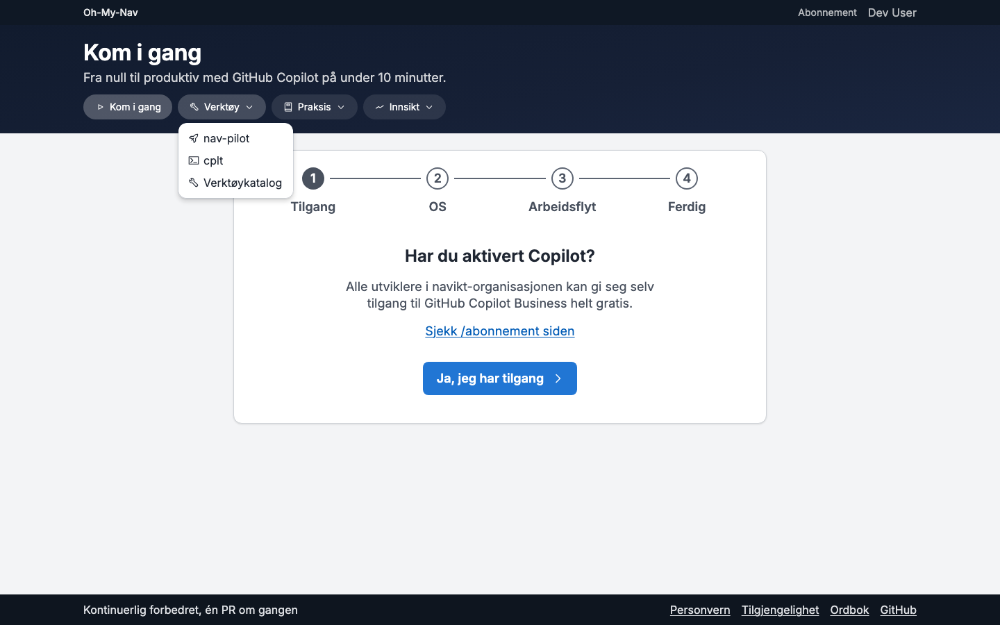
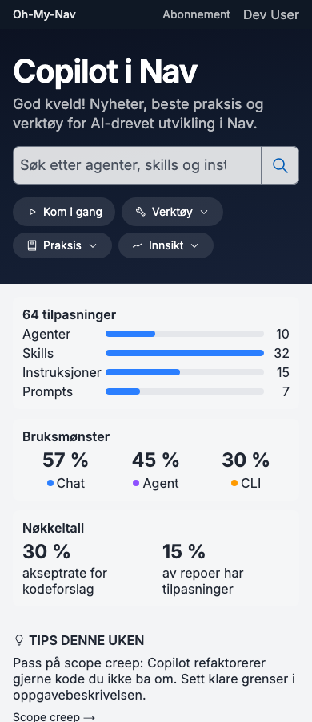
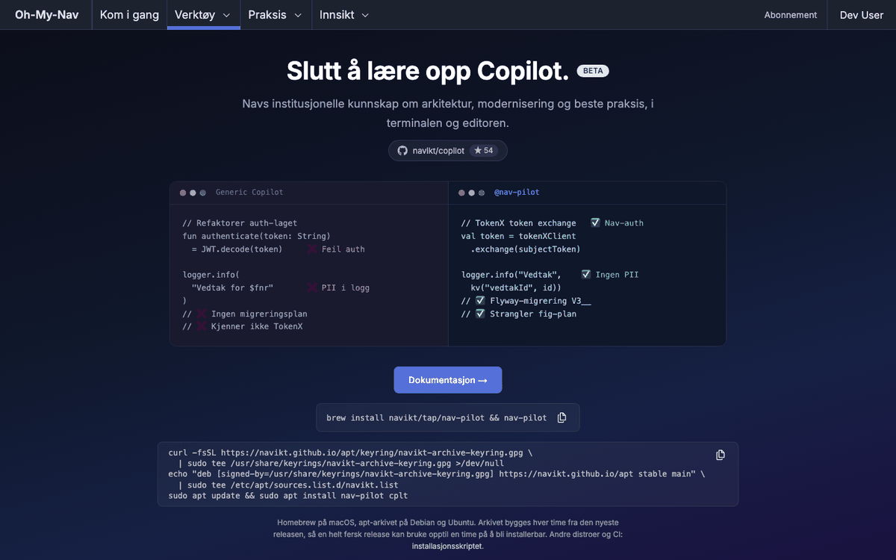

# Forslag: ny struktur for nav-pilot-dokumentasjonen og menyen på ki-utvikling.nav.no

**Status: vedtatt 27.09.2026.** Valgene i [§0](#0-valg-som-trengs) er tatt, se «Vedtak» under. Arbeidet deles i små PR-er, ett emne om gangen ([§6](#6-plan-for-gjennomføring)).

Hva som er lest på hvilken commit:

- Nettsiden (`apps/my-copilot`), `docs/README.nav-pilot.md` og Go-koden: `356c41a4` (`main`, 27.09.2026, rett etter #1006). Kommandoene er kjørt mot en binær bygget fra den committen, med en tom `HOME`.
- Klientfunnene i §3 bygger på notater tatt på `d24cac46`. Linjenumrene er sjekket på nytt på `356c41a4`.
- Menyprototypen i §5 ligger på grenen `proto/menu`, som bygger på `d24cac46`.

## 0. Valg som trengs

### Vedtak

- **V1:** Guider og Forklaring får én side per emnegruppe, med en myk grense på omtrent 400 linjer. Referanse og Klienter får én side hver.
- **V2:** `/nav-pilot/lokal` blir introduksjonen for Mac.
- **V3:** Alternativ B for hele nettstedet: en vanlig `<nav>` i toppfeltet med disclosure-mønsteret og hamburgermeny på mobil. I tillegg seksjonsmenyen fra C, bare for nav-pilot. Eierne av de andre sidene får se skjermbildene i meny-PR-en, og den flettes ikke inn før brukeren har sett dem.
- **V4:** Som foreslått. Valget av standardklient hører til #1022. Klientsiden viser paritetsstatusen fra #1022.
- **V5:** pi blir værende, merket «eksperimentell», med en liste over det som mangler.

### Forslaget som lå til grunn

| #   | Valg                                                  | Anbefaling                                                                                                                                                                                                                                | Alternativ                                                                         |
| --- | ----------------------------------------------------- | ----------------------------------------------------------------------------------------------------------------------------------------------------------------------------------------------------------------------------------------- | ---------------------------------------------------------------------------------- |
| V1  | URL-er og sidestørrelse for nav-pilot-dokumentasjonen | Én side for Referanse og én for Klienter. Guider og Forklaring får én side per emnegruppe, med en myk grense på omtrent 400 linjer per side ([§1.2](#12-url-er))                                                                          | Én side per Diátaxis-type (to sider på rundt 1000 linjer hver)                     |
| V2  | Hvor den lokale introduksjonen bor                    | Beholde `/nav-pilot/lokal` som introduksjonen for Mac                                                                                                                                                                                     | Flytte til `/nav-pilot/kom-i-gang/lokal` og la `/nav-pilot/lokal` peke dit         |
| V3  | Menyen                                                | B: meny i toppfeltet med fire grupper, og seksjonsmenyen fra C bare for nav-pilot ([§5.5](#55-anbefaling-v3))                                                                                                                             | A: grupperte piller i `PageHero`. C alene: fire lenker og seksjonsmeny per seksjon |
| V4  | Hvilke klienter nav-pilot skal støtte                 | Valget om standardklient tas i navikt/copilot#1022, ikke her. Dette forslaget følger vedtakene der og legger til to ting: Goose som mulig klient nummer fire, og at klientsiden viser paritetsstatusen fra #1022 ([§3.3](#33-anbefaling)) | Legge til Claude Code eller Codex (avvises, se §3.3)                               |
| V5  | pi                                                    | Beholde den som «eksperimentell» og si tydelig i tabellen hva som mangler                                                                                                                                                                 | Fjerne pi fra veiviseren                                                           |

## 1. Informasjonsarkitektur etter Diátaxis

### 1.1 Problemet i dag

- `/nav-pilot/docs` er 3297 linjer og 55 ankere på én side. Introduksjon, oppskrifter, oppslagstabeller og bakgrunn står om hverandre. «Kom i gang» (`#kom-i-gang`) kommer for eksempel etter sikkerhetsbakgrunnen (`#isolasjon-er-pakrevd`), og planleggingsmetodikken (`#planning-skills`) står mellom personvern og synkronisering.
- Den lokale modellen er beskrevet på tre steder: `/nav-pilot/lokal`, `/nav-pilot/docs#lokal-modell` og README. Oppskriftene er ulike. `docs#lokal-kom-i-gang` kjører `init` og så `start`, men `init` starter allerede serveren (se [§4.2](#42-hull)).
- `/nav-pilot/lokal` er en landingsside (#994) med målte tall midt i. Den er ikke en guide man kan følge.

[Diátaxis](https://diataxis.fr/) deler dokumentasjon i fire typer etter hva leseren trenger:

| Type                    | Leseren               | Form                                                      |
| ----------------------- | --------------------- | --------------------------------------------------------- |
| Introduksjon (tutorial) | lærer, er ny          | én vei fra start til mål, alle steg, ingen valg underveis |
| Guide (how-to)          | skal få gjort én ting | kort oppskrift, forutsetter at du kan det grunnleggende   |
| Referanse               | slår opp              | tabeller, fullstendig, gjerne generert fra koden          |
| Forklaring              | vil forstå            | hvorfor, avveiinger, målinger                             |

### 1.2 URL-er

Anbefaling (V1): Referanse og Klienter får én side hver. Det er oppslag, og leseren søker på siden. Guider og Forklaring får én side per emnegruppe. Introduksjonene får én side hver, fordi hver er én vei fra start til mål.

Grensen er myk: omtrent 400 linjer JSX per side. Linjetallene under er talt fra dagens `docs/page.tsx` (fra ett `id` til det neste) og er grove. Uten grensen får `/nav-pilot/guider` rundt 1030 linjer og 18 ankere, og `/nav-pilot/forklaring` rundt 1000. Da har vi to sider med de samme problemene som i dag: én `<title>` for søk, ett delingsbilde og ingen tittel per oppgave. Referansen er unntaket. Den blir rundt 500 linjer, men består av tabeller med innholdsfortegnelse.

| URL                                          | Type          | Innhold                                                                                                                                                                                 | Omtrent linjer |
| -------------------------------------------- | ------------- | --------------------------------------------------------------------------------------------------------------------------------------------------------------------------------------- | -------------- |
| `/nav-pilot`                                 | oversikt      | landingssiden, uendret. Knappen «Kom i gang» peker til `/nav-pilot/kom-i-gang`                                                                                                          | –              |
| `/nav-pilot/kom-i-gang`                      | introduksjon  | Kom i gang med nav-pilot. Nettstedet har også `/kom-i-gang` (Copilot generelt). Den siden lenker hit for nav-pilot, og tittelen her er «Kom i gang med nav-pilot» så de ikke forveksles | ny             |
| `/nav-pilot/lokal`                           | introduksjon  | Kom i gang med lokal modell (Mac), se [§2](#2-introduksjon-lokal-modell-på-mac). V2: alternativt `/nav-pilot/kom-i-gang/lokal`                                                          | ny             |
| `/nav-pilot/kom-i-gang/egen-server`          | introduksjon  | Kom i gang med egen server (Linux, Ollama, llama-server)                                                                                                                                | ny             |
| `/nav-pilot/kom-i-gang/decide`               | introduksjon  | Din første decide-hook                                                                                                                                                                  | ny             |
| `/nav-pilot/guider`                          | guider        | oversikt over guidene, bare lenker                                                                                                                                                      | kort           |
| `/nav-pilot/guider/installere-og-oppgradere` | guide         | velge installasjonssted, vanlige oppgaver, installere i CI, oppgradere, avinstallere                                                                                                    | 250            |
| `/nav-pilot/guider/tilpasse`                 | guide         | endre innstillinger, teamets egne instruksjoner, overstyre og ignorere komponenter, slå hooks av og på                                                                                  | 340            |
| `/nav-pilot/guider/synkronisere`             | guide         | synkronisering og spørsmål om den                                                                                                                                                       | 220            |
| `/nav-pilot/guider/lokal`                    | guide         | utsending, bytte modell (sky og lokal), decide-oppskrifter                                                                                                                              | 250            |
| `/nav-pilot/guider/feilsoking`               | guide         | `doctor`, logging av blokkeringer, feilsøking for lokal modell                                                                                                                          | 120            |
| `/nav-pilot/referanse`                       | referanse     | kommandoer, konfignøkler, nivåer, avslutningskoder, telemetri, lokale modeller, filstruktur                                                                                             | 500            |
| `/nav-pilot/klienter`                        | referanse     | klientstøtte, se [§3](#3-klientstøtte)                                                                                                                                                  | 300            |
| `/nav-pilot/forklaring`                      | forklaring    | oversikt over forklaringene, bare lenker                                                                                                                                                | kort           |
| `/nav-pilot/forklaring/planlegging`          | forklaring    | planleggingsmetodikken                                                                                                                                                                  | 270            |
| `/nav-pilot/forklaring/sandkassen`           | forklaring    | sandkassen og sikkerhetsnivåene                                                                                                                                                         | 145            |
| `/nav-pilot/forklaring/lokal-modell`         | forklaring    | hvorfor utsending er begrenset, målte grenser, hva som kommer                                                                                                                           | 300            |
| `/nav-pilot/forklaring/personvern`           | forklaring    | personvern og telemetri                                                                                                                                                                 | 95             |
| `/nav-pilot/forklaring/arkitektur`           | forklaring    | hvorfor nav-pilot, hva nav-pilot vet, arkitektur og designprinsipper                                                                                                                    | 230            |
| `/nav-pilot/agentpakker`                     | uendret       | siden er allerede en egen håndbok for pakkeforfattere. Får bare lenker inn fra guider og referanse                                                                                      | –              |
| `/nav-pilot/docs`                            | videresending | går til `/nav-pilot/referanse`. Gamle ankere sendes videre ([§1.4](#14-gamle-lenker-skal-virke))                                                                                        | –              |

Det er 15 nye sider, pluss to korte oversiktssider. Blir en side lengre enn grensen, deler vi den. Tabellen over gamle ankere i §1.4 sender gamle lenker videre.

Sidene får en felles seksjonsmeny (Oversikt, Kom i gang, Guider, Referanse, Klienter, Forklaring, Agentpakker). Den står i [§5](#5-menyen) fordi den henger sammen med toppmenyen.

### 1.3 Hvor alt flytter

Tabellene under dekker hver seksjon og hvert anker på `/nav-pilot/docs` (55 ankere: 54 i `DOC_SECTIONS`, linje 84–192, og `lokal-modeller`, som bare finnes i JSX), `/nav-pilot/lokal` (9) og `/nav-pilot` (ingen ankere, bare overskrifter).

**`/nav-pilot/docs`**

| Gammelt anker                                                                                                                               | Ny plass                                                                                                        | Type                  |
| ------------------------------------------------------------------------------------------------------------------------------------------- | --------------------------------------------------------------------------------------------------------------- | --------------------- |
| `introduksjon`, `hva-er-nav-pilot`                                                                                                          | `/nav-pilot/kom-i-gang#hva-er-nav-pilot` (kort) og `/nav-pilot`                                                 | introduksjon          |
| `isolasjon-er-pakrevd`                                                                                                                      | `/nav-pilot/forklaring/sandkassen`                                                                              | forklaring            |
| `cplt-sikkerhetsniva`, `nar-strict-ikke-anbefales`                                                                                          | `/nav-pilot/forklaring/sandkassen#sikkerhetsniva` (hvorfor) og `/nav-pilot/referanse#sikkerhetsniva` (tabellen) | forklaring, referanse |
| `logging-av-blokkeringer`                                                                                                                   | `/nav-pilot/guider/feilsoking#blokkeringer`                                                                     | guide                 |
| `hvorfor-nav-pilot`, `hva-nav-pilot-vet`                                                                                                    | `/nav-pilot/forklaring/arkitektur#hvorfor`                                                                      | forklaring            |
| `kom-i-gang`, `installasjon`                                                                                                                | `/nav-pilot/kom-i-gang`                                                                                         | introduksjon          |
| `hvor-installere`                                                                                                                           | `/nav-pilot/guider/installere-og-oppgradere#velg-installasjonssted`                                             | guide                 |
| `vanlige-oppgaver`                                                                                                                          | `/nav-pilot/guider/installere-og-oppgradere#vanlige-oppgaver`                                                   | guide                 |
| `klienter-og-konfig`, `stotte-klienter`, `opencode`                                                                                         | `/nav-pilot/klienter`                                                                                           | referanse             |
| `konfigurasjon`                                                                                                                             | `/nav-pilot/guider/tilpasse#endre-innstillinger`                                                                | guide                 |
| `konfig-nokler`                                                                                                                             | `/nav-pilot/referanse#konfignokler` (generert fra `configKeyDefs`, som i dag)                                   | referanse             |
| `personvern`                                                                                                                                | `/nav-pilot/forklaring/personvern` og `/nav-pilot/referanse#telemetri`                                          | forklaring, referanse |
| `collections`                                                                                                                               | `/nav-pilot/agentpakker#pakkene-som-finnes`                                                                     | referanse             |
| `planning-skills`, `planleggingspipelinen`, `fire-faser`, `skills-i-detalj`, `kompetansebevaring`, `gronn-rod-sone`, `demo-i-praksis`       | `/nav-pilot/forklaring/planlegging` (underankerne beholder navnet)                                              | forklaring            |
| `sync-og-oppdatering`, `automatisk-sync`, `lokal-sync`, `tilpasse-sync`                                                                     | `/nav-pilot/guider/synkronisere` (underankerne beholder navnet)                                                 | guide                 |
| `sync-faq`                                                                                                                                  | `/nav-pilot/guider/synkronisere#faq`                                                                            | guide                 |
| `tilpasning`, `team-egne-instruksjoner`, `prosjektkontekst-med-nav-pilot-init`, `overstyre-installerte-filer`, `ignorere-enkeltkomponenter` | `/nav-pilot/guider/tilpasse` (underankerne beholder navnet)                                                     | guide                 |
| `lokal-modell`                                                                                                                              | `/nav-pilot/lokal`                                                                                              | introduksjon          |
| `lokal-kom-i-gang`                                                                                                                          | `/nav-pilot/lokal#installer`                                                                                    | introduksjon          |
| `lokal-modeller` (finnes i koden, ikke i innholdsfortegnelsen, lenket 3 ganger)                                                             | `/nav-pilot/referanse#lokale-modeller`                                                                          | referanse             |
| `lokal-egen-server`                                                                                                                         | `/nav-pilot/kom-i-gang/egen-server`                                                                             | introduksjon          |
| `lokal-utsending`                                                                                                                           | `/nav-pilot/guider/lokal#utsending` (hvordan) og `/nav-pilot/forklaring/lokal-modell#utsending` (hvorfor)       | guide, forklaring     |
| `lokal-hva-den-klarer`                                                                                                                      | `/nav-pilot/forklaring/lokal-modell#malte-grenser`                                                              | forklaring            |
| `lokal-decide`                                                                                                                              | `/nav-pilot/kom-i-gang/decide`                                                                                  | introduksjon          |
| `lokal-decide-oppskrifter`                                                                                                                  | `/nav-pilot/guider/lokal#decide-oppskrifter`                                                                    | guide                 |
| `lokal-feilsoking`                                                                                                                          | `/nav-pilot/guider/feilsoking#lokal`                                                                            | guide                 |
| `cli-referanse`, `kommandooversikt`                                                                                                         | `/nav-pilot/referanse#kommandoer`                                                                               | referanse             |
| `installer-cli`                                                                                                                             | `/nav-pilot/kom-i-gang#installer`                                                                               | introduksjon          |
| `oppgrader-cli`                                                                                                                             | `/nav-pilot/guider/installere-og-oppgradere#oppgradere`                                                         | guide                 |
| `slik-fungerer-det`, `filstruktur`                                                                                                          | `/nav-pilot/referanse#filstruktur`                                                                              | referanse             |
| `ressurser`, `lenker`                                                                                                                       | bunnen av hver side                                                                                             | –                     |
| `arkitektur`, `designprinsipper`                                                                                                            | `/nav-pilot/forklaring/arkitektur`                                                                              | forklaring            |

**Nye guider som ikke finnes i dag**

Disse oppgavene står spredt i README, i `--help` eller ingen steder. De får egne ankere:

| Nytt anker                                                   | Innhold                                                                                                                           |
| ------------------------------------------------------------ | --------------------------------------------------------------------------------------------------------------------------------- |
| `/nav-pilot/guider/lokal#bytte-modell`                       | bytte skymodell: `nav-pilot models`, `nav-pilot config set model <id>`                                                            |
| `/nav-pilot/guider/lokal#bytte-lokal-modell`                 | `nav-pilot alpha local models`, `nav-pilot alpha local use <key>`, `nav-pilot alpha local init`                                   |
| `/nav-pilot/guider/feilsoking#doctor`                        | `nav-pilot doctor`, `nav-pilot config validate` og `nav-pilot alpha local doctor` (bare for egen server)                          |
| `/nav-pilot/guider/installere-og-oppgradere#avinstallere`    | `uninstall` per omfang, og så binæren, `~/.nav-pilot/` og lokale data (H10)                                                       |
| `/nav-pilot/guider/installere-og-oppgradere#installere-i-ci` | `nav-pilot install <navn> --frozen --force`, og hva kode 3 betyr                                                                  |
| `/nav-pilot/guider/tilpasse#hooks`                           | slå sløyfevakten og maskeringen av og på med `hook_loop_guard`, `hook_redact_secrets`, `hook_redact_fnr` og `hook_injection_note` |

**`/nav-pilot/lokal`** (siden blir introduksjonen, se §2)

| Gammelt anker                           | Ny plass                                                                              |
| --------------------------------------- | ------------------------------------------------------------------------------------- |
| `hva-du-far`                            | blir innledningen på `/nav-pilot/lokal` (kortere)                                     |
| `kom-i-gang`                            | `/nav-pilot/lokal#installer`, på samme side. Se §1.4 om den ekstra `id`-en            |
| `egen-server`                           | `/nav-pilot/kom-i-gang/egen-server`                                                   |
| `utsending`                             | `/nav-pilot/forklaring/lokal-modell#utsending` og `/nav-pilot/guider/lokal#utsending` |
| `malt`, `malt-utsending`, `malt-decide` | `/nav-pilot/forklaring/lokal-modell#malte-grenser` (underankerne beholder navnet)     |
| `hva-kommer`                            | `/nav-pilot/forklaring/lokal-modell#hva-kommer`                                       |
| `lenker`                                | bunnen av siden                                                                       |

**`/nav-pilot`**: overskriften «Kom i gang» (linje 1011) blir en kort blokk som lenker til `/nav-pilot/kom-i-gang`. Resten blir stående.

**`docs/README.nav-pilot.md`**: nettsiden er hoveddokumentasjonen. README beholder installasjon og en lenkeliste. Avsnittet `## Lokal modell (alfa, av som standard)` (linje 478–795, med decide fra linje 701) erstattes av lenker. Ellers glir de tre versjonene fra hverandre igjen.

### 1.4 Gamle lenker skal virke

Nyhetssakene, README, `README.sync.md`, veiviseren på `/kom-i-gang` og andre sider lenker til 13 forskjellige ankere på `/nav-pilot/docs`. Flest lenker går til `#lokal-modeller` og `#lokal-egen-server`, med 3 hver. CLI-en lenker ikke til nettsidene, så binærer som allerede er ute, påvirkes ikke.

Nettleseren sender aldri `#anker` til serveren. En videresending på serveren kan derfor ikke velge mål etter anker. Nettleseren tar med seg ankeret gjennom en 301 eller 308, men da havner for eksempel `#lokal-egen-server` på `/nav-pilot/referanse`, som ikke har det. Løsningen har to deler:

1. **Videresending på serveren.** En permanent oppføring i `redirects()` i `next.config.ts`: `{ source: "/nav-pilot/docs", destination: "/nav-pilot/referanse", permanent: true }`. Det gir en ekte 308. Søkemotorer flytter indeksen, og det virker uten JavaScript. `/nav-pilot/docs/page.tsx` slettes.
2. **Tabell over gamle ankere i `HashAnchorScroll`.** `components/hash-anchor-scroll.tsx` er allerede montert på alle sider fra `site-shell.tsx`. Den leser `location.hash` og prøver igjen til elementet finnes (inntil 120 forsøk, 50 ms mellom). Vi legger til én tabell `gammelt anker → ny URL`. Finnes ikke `id`-en ved første forsøk, og ankeret står i tabellen, kaller komponenten `router.replace(nyUrl)` med en gang i stedet for å vente. Sidene er rendret på serveren, så en `id` som finnes, er der allerede ved første forsøk. Komponenten må da også bruke `useRouter`.

En enhetstest ved siden av `hash-anchor-scroll.test.tsx` sjekker at hvert mål i tabellen finnes som `id` på målsiden.

Når et anker flytter innenfor samme side (`/nav-pilot/lokal#kom-i-gang` til `#installer`), trengs ingen tabell. Et element kan bare ha én `id`, så den nye overskriften pakkes inn i en `<div id="kom-i-gang">` rundt `<h2 id="installer">`. Velger vi alternativet i V2, får `/nav-pilot/lokal` en egen oppføring i `redirects()` til `/nav-pilot/kom-i-gang/lokal`. Ankeret følger med, så den samme `<div id="kom-i-gang">` trengs på den nye siden.

Interne lenker oppdateres til de nye URL-ene i samme PR. Tabellen trengs bare for lenker utenfra.

## 2. Introduksjon: lokal modell på Mac

`/nav-pilot/lokal` blir en guide med seks steg. Tallene fra målingene (`malt`, `malt-utsending`, `malt-decide`) flyttes til `/nav-pilot/forklaring/lokal-modell#malte-grenser`, og guiden lenker dit én gang. Hjelpeteksten til kommandoene under er sjekket mot `356c41a4`.

**Tittel:** Kom i gang med lokal modell på Mac
**Ingress:** Du installerer nav-pilot, laster ned en kodemodell og kjører en første økt der hovedagenten i skyen sender en oppgave til modellen på maskinen din. Det tar omtrent 30 minutter, mest nedlasting.

1. **Sjekk maskinen.** Du trenger Apple Silicon, minst 48 GB minne og omtrent 30 GB ledig disk. Vektene er 25 GB, resten er et Python-miljø. Siden henter tallene fra modellmanifestet (`min_ram_gb`, `weights_gb` i `internal/local/models.json`), slik den gjør i dag. `init` skriver «about 26 GB» fordi den regner med miljøet.
   ```sh
   uname -m                              # arm64
   sysctl -n hw.memsize | awk '{print $1/2^30 " GB"}'
   df -h ~
   ```
   Har du ikke dette, gå til [Kom i gang med egen server](/nav-pilot/kom-i-gang/egen-server).
2. **Installer.** Hopp over hvis du har gjort [Kom i gang med nav-pilot](/nav-pilot/kom-i-gang).
   ```sh
   brew install navikt/tap/nav-pilot navikt/tap/cplt
   brew upgrade navikt/tap/nav-pilot    # har du den fra før
   ```
3. **Sett opp modellen.** `init` viser modellen, hva den krever, hva den laster ned og fra hvilke verter. Så spør den før den starter. Den ber om passordet ditt én gang for å heve minnegrensen i macOS. Når den er ferdig, kjører serveren.
   ```sh
   nav-pilot alpha local init
   nav-pilot alpha local status        # Model, Server og wired limit skal være grønne
   ```
   Etter en omstart av maskinen: `nav-pilot alpha local start`. Den spør før den hever grensen igjen.
4. **Første økt.** Utsending krever opencode som klient.
   ```sh
   nav-pilot config set client opencode
   cd ~/kode/mitt-repo
   nav-pilot
   ```
   Be om en mekanisk endring over flere filer, for eksempel «legg til parameteren `ctx` i alle kall til `hentBruker`». Med standardnivået `balanced` stopper nav-pilot hovedagenten når endringen når fem filer. Da ber nav-pilot den sende jobben til `local-worker`. Etterpå viser `nav-pilot alpha local status` hva modellen har gjort. Hvis serveren ikke kjørte, sier nav-pilot fra både før og etter økten at alt gikk i skyen (`opencode_launch.go:1210-1222`).
5. **Første decide.**
   ```sh
   echo "Legg til retry i klienten" | nav-pilot alpha decide \
     "Forklarer commit-meldingen hvorfor endringen ble gjort?" --options yes,no --evidence -
   ```
   Du får en sannsynlighet per svar på under et halvt sekund. Neste steg er [Din første decide-hook](/nav-pilot/kom-i-gang/decide).
6. **Hvor du går videre.**
   - Skru utsending opp eller ned: `/nav-pilot/guider/lokal#utsending`
   - Bytt lokal modell: `/nav-pilot/guider/lokal#bytte-lokal-modell`
   - Når noe henger: `/nav-pilot/guider/feilsoking#lokal`
   - Hva modellen klarer, målt: `/nav-pilot/forklaring/lokal-modell#malte-grenser`
   - Skru det av: `nav-pilot alpha local off` (vektene blir liggende) eller `nav-pilot alpha local purge` (sletter dem)

Steg 4 og 5 må kjøres på en ren Mac før siden publiseres, og utdataene limes inn som eksempel. Kommandoene er sjekket mot hjelpeteksten, men selve økten er ikke kjørt i dette arbeidet.

**Kom i gang med egen server** følger samme mal, i denne rekkefølgen (fra `nav-pilot alpha local --help`):

1. Start serveren. Oppskriftene for Ollama og llama-server finnes i `EGEN_SERVER` i `lokal/page.tsx`, under `#lokal-egen-server` i `docs/page.tsx` og i README.
2. `nav-pilot alpha local setup` finner serveren og velger modell. Den lagrer `local_endpoint`, `local_endpoint_model` og `local_enabled = true` bare hvis du svarer ja (`alpha_local_setup.go:548-552`).
3. `nav-pilot alpha local init` sjekker serveren og slår den på. Med egen server laster den ikke ned noe.
4. `nav-pilot alpha local doctor` sjekker verktøykall, logprobs, kontekst og tid til første token. Den sjekker bare egen server (`local_endpoint`).
5. `nav-pilot config set client opencode`.
6. Første økt.

Siden merkes «alfa, ikke målt».

**Din første decide-hook**: start serveren, lag `scripts/commit-explains-why.sh` (skriptet `COMMIT_EXPLAINS_WHY_HOOK` fra `docs/page.tsx`), kjør `chmod +x` og koble det til som `.git/hooks/commit-msg` (vanlig git). Siden viser pre-commit og lefthook som alternativer. Test det med `nav-pilot alpha decide --eval cases.jsonl`. Siden må si hva som skjer når serveren ikke kjører: `decide` svarer med kode 2 (`alpha_decide.go:97`), og hooken slipper commiten gjennom, fordi skriptet alltid avslutter med 0.

## 3. Klientstøtte

Kildene er koden under `cli/nav-pilot/internal/`, PR-ene i tabellen, navikt/copilot#1022 og et nettsøk 27.09.2026 for klientene nav-pilot ikke støtter. Lenkene står i [§3.5](#35-kilder).

### 3.1 Klientene nav-pilot støtter

Standard er `copilot` (`cli/config.go:492`). Du velger med `nav-pilot config set client <navn>` eller `--client` per kjøring.

Saken #1022 har allerede en paritetstabell for Copilot CLI og opencode. Tabellen under er et utkast til nettsidens versjon. Den legger til pi og bruker samme kilder, og den skal holdes i takt med #1022 (se §3.3).

|                                                    | Copilot CLI                                                                                                                                                                                                                 | opencode                                                                                                                                                                                     | pi                                                                   |
| -------------------------------------------------- | --------------------------------------------------------------------------------------------------------------------------------------------------------------------------------------------------------------------------- | -------------------------------------------------------------------------------------------------------------------------------------------------------------------------------------------- | -------------------------------------------------------------------- |
| Støttet                                            | Ja, standard                                                                                                                                                                                                                | Ja (#306)                                                                                                                                                                                    | Delvis, «eksperimentell» (#812)                                      |
| cplt-sandkasse                                     | Foretrukket. Finnes ikke cplt, spør nav-pilot i terminalen før den starter `copilot` uten sandkasse. `--no-sandbox` hopper over spørsmålet. Uten terminal og uten flagget starter den ikke (`cli/interactive.go:1056-1095`) | Påkrevd (`provider/provider.go:253-259`). Uten cplt: #1028                                                                                                                                   | Påkrevd (`provider/provider.go:496-502`)                             |
| Agentpakke: agenter                                | `--agent` (`copilot_launch.go:130-157`)                                                                                                                                                                                     | `--agent`, filer i `~/.config/opencode/agents/` (`opencode_launch.go:188-273`). `tools:`-begrensninger følger ikke med (#1026)                                                               | Ingen `--agent`. Personaen blir systemprompt (`pi_launch.go:75-100`) |
| Agentpakke: skills                                 | `NAV_PILOT_SKILLS_DIR` (#859)                                                                                                                                                                                               | `~/.config/opencode/skills/`                                                                                                                                                                 | `--skill <mappe>`                                                    |
| Agentpakke: instruksjoner                          | `.github/` eller `COPILOT_CUSTOM_INSTRUCTIONS_DIRS` (#932)                                                                                                                                                                  | `AGENTS.md`                                                                                                                                                                                  | `AGENTS.md` via `--append-system-prompt`                             |
| Hooks (sløyfevakt, maskering)                      | Ja, begge, på som standard (#939, #940, #991, #953)                                                                                                                                                                         | Nei. nav-pilot skriver hooks bare for Copilot (`cli/hook_cmd.go:248`). opencode kan ha plugins [37], og dispatch-gaten (`nav-pilot-dispatch-gate.js`) er allerede en. Portering: #1025, #709 | Nei                                                                  |
| MCP                                                | Klientens eget oppsett. nav-pilot skriver ikke MCP-konfig (#826)                                                                                                                                                            | Samme. MCP-allowlist: #1027                                                                                                                                                                  | Samme                                                                |
| Lokal utsending (`local-worker`, `local_dispatch`) | Nei. En lokal modell tar hele økten (#483). Venter på github/copilot-cli#4703                                                                                                                                               | Ja, eneste klient (#996, #999)                                                                                                                                                               | Nei                                                                  |
| `local_endpoint` (egen server)                     | Ja, hele økten (#998, #1000)                                                                                                                                                                                                | Ja                                                                                                                                                                                           | Nei                                                                  |
| Innlogging med Copilot-abonnementet                | Ja (`copilot_auth_mode`, #424)                                                                                                                                                                                              | Ja. GitHub har støttet det offisielt siden 16.01.2026 [36]                                                                                                                                   | Sannsynlig via pis egen `github-copilot`-leverandør. Ikke verifisert |
| macOS / Linux                                      | Ja / ja. Ingen Windows-bygg (`release-nav-pilot.yaml:62-69`)                                                                                                                                                                | Ja / ja                                                                                                                                                                                      | Ja / ja                                                              |
| Lokal server som nav-pilot styrer                  | Bare Apple Silicon (`local/runtime.go:429-435`). På Linux: egen server                                                                                                                                                      | Samme                                                                                                                                                                                        | –                                                                    |

Tabellen må si tydelig at **en opencode- eller pi-økt mot skyen har verken sløyfevakt eller maskering av hemmeligheter og fødselsnummer.** I dag står det bare indirekte i README.

### 3.2 Andre klienter

Tallene i hakeparentes viser til kildelista i §3.5. «?» betyr at vi ikke har bekreftet det.

| Klient             | Copilot-abonnement                                            | Lokal / OpenAI-kompatibel    | Underagent på annen modell                                | Hooks                                      | MCP      | Lisens                        | cplt i dag                                   |
| ------------------ | ------------------------------------------------------------- | ---------------------------- | --------------------------------------------------------- | ------------------------------------------ | -------- | ----------------------------- | -------------------------------------------- |
| Claude Code        | Bare via proxy (brudd på vilkår, fare for utestenging) [4][5] | Via `ANTHROPIC_BASE_URL` [1] | Annen modell ja, annen leverandør nei [2][3]              | Ja, men de kjører ikke i underagenter [38] | Ja       | Proprietær                    | Ja                                           |
| Codex CLI          | Nei [6]                                                       | Ja [6]                       | Ja, men sperret med ChatGPT-innlogging [7]                | Ja                                         | Ja       | Apache-2.0 [8]                | Nei                                          |
| Goose              | **Ja, innebygd** [9]                                          | Ja [13]                      | **Ja, annen leverandør** (`GOOSE_SUBAGENT_PROVIDER`) [10] | Ja [11]                                    | Ja       | Apache-2.0                    | **Ja**                                       |
| Gemini CLI         | Nei                                                           | Nei [16]                     | Bare Gemini [14]                                          | Ja [15]                                    | Ja       | Apache-2.0                    | Ja                                           |
| Qwen Code          | Nei                                                           | Ja [17]                      | Ja, annen leverandør [18]                                 | Ja [17]                                    | Ja       | Apache-2.0                    | Nei                                          |
| Aider              | Ja, ifølge dokumentasjonen [19]                               | Ja                           | Nei                                                       | Nei                                        | Nei [20] | Apache-2.0                    | Nei (lite aktivitet siden august 2025?) [21] |
| Cline              | Bare i VS Code, ikke i CLI-en [22][23]                        | Ja                           | Bare lesende [24]                                         | Ja [25]                                    | Ja       | Apache-2.0                    | Nei (IDE først)                              |
| Kilo Code          | ? i CLI-en [26][27]                                           | Ja                           | ?                                                         | ?                                          | Ja       | MIT                           | Nei (CLI-en er en opencode-fork)             |
| Crush              | ? [29][30]                                                    | Ja [28]                      | ?                                                         | Foreløpig [28]                             | Ja       | FSL-1.1 (ikke åpen kildekode) | Nei                                          |
| Zed                | Ja [31]                                                       | Ja [31]                      | Ja, egen modell ?                                         | Nei [32]                                   | Ja       | GPL-3.0                       | Nei (editor)                                 |
| Roo Code, Continue | –                                                             | –                            | –                                                         | –                                          | –        | Apache-2.0                    | Lagt ned i 2026 [33][34][35]                 |

cplt-kolonnen er fra `cplt --help` (versjon 2026.09.24).

### 3.3 Anbefaling

Om opencode skal bli standardklient, avgjøres i navikt/copilot#1022 «Proposal: make OpenCode the default nav-pilot client». Saken er åpen. Vedtakene fra 27.09.2026 der er:

1. Lokal worker og dispatch-gate finnes bare i opencode, og det skal stå tydelig i klientinformasjonen på ki-utvikling.
2. Hooks og `tools:`-begrensninger skal porteres til opencode der det går. Der det ikke går, dokumenteres gapet nøyaktig.
3. Eksisterende brukere flyttes ikke. De får et tilbud om opencode.
4. nav-pilot håndhever policy for opencode ved oppstart.
5. Gapet mellom klientene skal lukkes så langt det går.

Paritetsplanen i #1022 er disse sakene:

- #1025: de innebygde hookene og Python-gatene i opencode-økter, som en nav-pilot-plugin
- #709: agentpakke-hooks som opencode-plugin
- #1026: `tools:`-begrensninger som `permission` per agent i opencode
- #1027: policy for opencode (`share`, autoupdate, MCP-allowlist, testet versjonsområde)
- #1028: opencode uten cplt (`--no-sandbox`, CI) og veiledning for WSL
- #1029: lagre den effektive klienten til eksisterende brukere før standarden endres, og tilbudet om opencode

Det siste punktet i paritetsplanen er at klientsiden på ki-utvikling skal vise den endelige paritetsstatusen. Det er et krav til PR 3: `/nav-pilot/klienter` viser status for #1025–#1029 og #709, og oppdateres når sakene lukkes.

Dette forslaget tar ikke stilling til standardklienten. Det legger til dette:

1. **Innspill til #1022 om lokal utsending.** Hybridrapporten (`reports/2026-09-27-hybrid-orchestration-research/research.md` §4 i mlx-workspace) setter besparelsen til noen cent per jobb med Sonnet 5-priser. Sonnet 5 sendte oppgaver i 1 av 29 kjøringer. Nettsiden beskriver derfor opencode som klienten for lokal utsending, noe du velger selv. Får Copilot CLI underagenter på egen leverandør (github/copilot-cli#4703), faller hovedgrunnen til opencode bort. Det står også i #1022.
2. **Klient nummer fire, hvis noen: Goose.** Den har innebygd Copilot-innlogging og underagenter på en annen leverandør, som er samme form som `local-worker`. Den har også hooks, MCP, skills og `AGENTS.md` [11][12]. Lisensen er Apache-2.0, og cplt kan allerede kjøre den.
3. **Ikke Claude Code, Codex, Gemini CLI eller Qwen Code.** Ingen av dem kan bruke Copilot-abonnementet uten en proxy som bryter vilkårene, og Nav kjøper modelltilgang gjennom Copilot. Det er et lisensvalg, ikke et teknisk: cplt kjører allerede `claude` og `gemini`.
4. **pi (V5).** #1022 holder pi utenfor. pi har ingen hooks, ingen utsending og ingen `--agent`, og flere innstillinger ignoreres med en advarsel (`pi_launch.go:132-156`). En lokal modell-id går til pi som `--model mlx/<id>` (`pi_launch.go:116-125` via `ToOpenCodeModel`, `provider.go:131-132`). Vi har ikke sjekket om pi har en `mlx`-leverandør. Enten fikser vi dette og sier hva som mangler, eller så tar vi pi ut av veiviseren.

### 3.4 Feil i eksisterende dokumenter

Rettes i PR 3:

- `cli/nav-pilot/DESIGN.md:150` kaller pi en stub. pi er implementert (#812).
- `DESIGN.md:149,170` sier at opencode starter med `opencode run`. Den starter TUI-en.
- `DESIGN.md:84-86` sier at en Copilot-id uten prefiks gir feil i opencode. Koden legger til `github-copilot/` (`provider.go:296-305`).
- `DESIGN.md:156-157` lister klientene cplt støtter (`gemini`, `antigravity`, `shell`). `claude`, `goose` og `dsh` mangler.
- README:881 sier «Alle kjører i cplt-sandkassen». Copilot kan kjøre uten.
- README:343 sier at Copilot-konteksten «Installeres i `.github/`». Med `--user` havner den i `~/.copilot/`.
- README:3 nevner ikke pi.
- `docs/CLIENT-SUPPORT-MATRIX.md` dekker bare GitHubs egne klienter og har ingen rad for hooks. Den bør lenke til `/nav-pilot/klienter` for nav-pilot-klientene.

### 3.5 Kilder

Nettsøk 27.09.2026. Tallene brukes i §3.1, §3.2 og §3.3.

1. Ollama: Claude Code. https://docs.ollama.com/integrations/claude-code
2. anthropics/claude-code#38698. https://github.com/anthropics/claude-code/issues/38698
3. Claude Code: sub-agents. https://code.claude.com/docs/en/sub-agents
4. copilot-api. https://github.com/ericc-ch/copilot-api
5. GitHub Community, diskusjon 178117. https://github.com/orgs/community/discussions/178117
6. Codex: avansert konfigurasjon. https://developers.openai.com/codex/config-advanced
7. openai/codex#47752. https://github.com/openai/codex/issues/47752
8. openai/codex. https://github.com/openai/codex
9. block/goose#1926 (Copilot-leverandør). https://github.com/block/goose/pull/1926
10. Goose: subagents. https://goose-docs.ai/docs/guides/context-engineering/subagents
11. dyoshikawa/rulesync#2404 (Goose-hooks). https://github.com/dyoshikawa/rulesync/issues/2404
12. Goose: skills. https://goose-docs.ai/docs/guides/context-engineering/using-skills/
13. block/goose. https://github.com/block/goose
14. Gemini CLI: subagents. https://geminicli.com/docs/core/subagents/
15. google-gemini/gemini-cli, diskusjon 17790 (hooks). https://github.com/google-gemini/gemini-cli/discussions/17790
16. google-gemini/gemini-cli#23385 (lokale modeller). https://github.com/google-gemini/gemini-cli/issues/23385
17. QwenLM/qwen-code. https://github.com/QwenLM/qwen-code
18. Qwen Code: sub-agents. https://github.com/QwenLM/qwen-code/blob/main/docs/users/features/sub-agents.md
19. Aider: GitHub Copilot. https://aider.chat/docs/llms/github.html
20. Warp: Aider og MCP. https://www.wearewarp.com/agents/mcp/aider
21. DeployHQ: Aider. https://www.deployhq.com/guides/aider
22. Cline: VS Code Language Model API. https://docs.cline.bot/provider-config/vscode-language-model-api
23. cline/cline#9550. https://github.com/cline/cline/issues/9550
24. Cline: subagents. https://docs.cline.bot/features/subagents
25. Cline v3.36: hooks. https://cline.bot/blog/cline-v3-36-hooks
26. Kilo-Org/kilocode. https://github.com/Kilo-Org/kilocode
27. Kilo: VS Code LM. https://kilo.ai/docs/ai-providers/vscode-lm
28. charmbracelet/crush. https://github.com/charmbracelet/crush
29. charmbracelet/crush#3707. https://github.com/charmbracelet/crush/issues/3707
30. charmbracelet/crush#348. https://github.com/charmbracelet/crush/issues/348
31. Zed: LLM-leverandører. https://zed.dev/docs/ai/llm-providers
32. zed-industries/zed, diskusjon 57943 (hooks). https://github.com/zed-industries/zed/discussions/57943
33. The New Stack: Roo Code. https://thenewstack.io/roo-code-cloud-ides-ai-coding/
34. continuedev/continue. https://github.com/continuedev/continue
35. Bodega One: Cursor kjøper Continue. https://www.bodegaone.ai/blog/cursor-acquires-continue-dev
36. GitHub Changelog 16.01.2026: Copilot støtter opencode. https://github.blog/changelog/2026-01-16-github-copilot-now-supports-opencode/
37. opencode: agents og plugins. https://opencode.ai/docs/agents/ og https://opencode.ai/docs/plugins
38. anthropics/claude-code#34692 (hooks i underagenter). https://github.com/anthropics/claude-code/issues/34692

## 4. Installasjon og oppstart

### 4.1 Én vei fra null

Dette blir `/nav-pilot/kom-i-gang`. Spørsmålene i veiviseren er sjekket mot koden. Rekkefølgen i steg 4 og det som skjer når cplt starter, er hentet fra notater og ikke kjørt i dette arbeidet. Steget må kjøres én gang i et tomt repo før siden publiseres.

1. **Forutsetninger.** Copilot-abonnement ([/abonnement](/abonnement)), tilgang til navikt, Homebrew (Mac) eller apt (Linux), `gh auth login`.
2. **Copilot CLI.** `curl -fsSL https://gh.io/copilot-install | bash`. cplt installerer den ikke.
3. **nav-pilot og cplt.** `brew install navikt/tap/nav-pilot navikt/tap/cplt`. Linux: apt-pakken, eller `scripts/install.sh` hvis du ikke kan bruke apt.
4. **Første kjøring.** `cd <repo> && nav-pilot`. Veiviseren spør om klient, modus, modell, resonneringsnivå og automatisk oppdatering (`cli/config_setup.go:120`, `:134`, `:154`, `:161`, `:180`). Så kommer et varsel om telemetri (`cli/cli.go:1146`) og et spørsmål om rtk (`cli/rtk_setup.go:84`). Deretter velger du pakke og om den skal installeres i repoet (`.github/`) eller for deg (`~/.copilot/`). Til slutt starter cplt, som først ber om sin egen bekreftelse, og så Copilot. Utenfor et git-repo tilbys bare installasjon for deg.
5. **Valgfritt: lokal modell** på Mac (`alpha local init`) eller egen server (`alpha local setup`, `local_endpoint`). Se §2.

### 4.2 Hull

| #   | Hull                                                                                                                                                                               | Hvor                                                               |
| --- | ---------------------------------------------------------------------------------------------------------------------------------------------------------------------------------- | ------------------------------------------------------------------ |
| H1  | Installasjonskommandoen er ulik på hver side. Landingssiden og `/nav-pilot/lokal` har ikke med cplt. `docs#installer-cli` har bare nav-pilot                                       | `nav-pilot/page.tsx:53`, `lokal/page.tsx:44`, `docs/page.tsx:2855` |
| H2  | Copilot CLI og abonnementet står bare i veiviseren på `/kom-i-gang`. `doctor` sjekker ikke om `copilot` finnes, og start uten gir bare `copilot cli not found`                     | `provider/copilot_launch.go:225`                                   |
| H3  | Førstegangsveiviseren (fem spørsmål), rtk-spørsmålet og telemetrivarselet er ikke beskrevet noe sted                                                                               | `docs#installasjon`                                                |
| H4  | Veiviseren på `/kom-i-gang` skriver `export PATH="$HOME/.local/bin:$PATH"` også for brew, og bruker `curl … \| bash` på Linux uten apt. README advarer mot det siste               | `interactive-setup-wizard.tsx:82,91`                               |
| H5  | Råd om installasjonssted spriker. README sier det kommer an på, `doctor`/`sync`/`list` foreslår `--user`, og veiviseren på nettet bruker `--repo`                                  | `interactive-setup-wizard.tsx:96`                                  |
| H6  | Lokal oppstart står 3–4 steder med ulike steg. `docs#lokal-kom-i-gang` kjører `init` og så `start`, men `init` starter serveren                                                    | `docs/page.tsx:2229-2231`                                          |
| H7  | commit-msg-hooken står to steder. README mangler filsti og installasjonssteg, og nettsiden mangler vanlig `.git/hooks`. Ingen sier at hooken slipper alt gjennom når serveren står | README:717-737, `docs#lokal-decide-oppskrifter`                    |
| H8  | `help <kommando>` viser den globale hjelpen for `doctor`, `env`, `init`, `export`, `feedback`, `validate` og `ignore`. `alpha local setup --help` gir kode 2                       | `cli/help.go`                                                      |
| H9  | Avslutningskoder står tre steder med ulikt innhold. `docs#kommandooversikt` mangler 3 (`--frozen`) og har to ulike lister over `--json`-kommandoer                                 | `docs/page.tsx:286`, `:3046`                                       |
| H10 | Avinstallering: `uninstall` fjerner ett omfang om gangen. Hvordan du fjerner binæren, `~/.nav-pilot/` og lokale data, står ingen steder                                            | `docs/page.tsx:279`                                                |
| H11 | `--local-dispatch` virker, men står ikke i `--help`                                                                                                                                | `cli/cli.go:422`                                                   |
| H12 | To forskjellige «off»: `config set local_dispatch off` (ingen utsending) og `alpha local off` (ingen lokal modell). `status` skriver «Dispatch off» om det siste                   | –                                                                  |
| H13 | README lister 11 av 23 telemetrimålinger                                                                                                                                           | README:834-844, `telemetry/telemetry.go:187-287`                   |
| H14 | Ingen feilsøking for sudo og minnegrense ved `start`                                                                                                                               | `docs#lokal-feilsoking`                                            |

H1–H7, H9, H10, H12 og H13 løses i dokumentasjonen. H8 og H11 er CLI-feil og bør bli egne saker. H2, at `doctor` bør sjekke `copilot`, er også en CLI-endring.

### 4.3 Referanse som genereres fra koden

Konfignøklene genereres allerede fra `configKeyDefs` (`TestConfigKeyDocs`). Vi bør gjøre det samme for:

- avslutningskoder: `cli/cli.go:42-53` og `exitCodeFor` (`cli.go:1155-1192`)
- telemetri: de 23 målingene i `telemetry/telemetry.go:187-287`
- kommandoer: `cli/help.go`

Da kan ikke referansen og koden gli fra hverandre. Det er en egen, liten CLI-PR.

## 5. Menyen

### 5.1 I dag

Toppfeltet har ingen meny. `site-shell.tsx` har bare logoen og brukernavnet. Menyen er ti pilleknapper (`lib/nav-items.ts`) som `page-hero.tsx` tegner øverst på 13 sider. Forsiden (`(home)/page.tsx`) tegner pillene selv, og har i tillegg en andre meny: `Sidebar` (`components/sidebar.tsx`), der `QuickNav` viser de seks første lenkene (`NAV_ITEMS.slice(0, 6)`) med sitt eget låsikon. Hver ny side har gjort lista lengre.

- På mobil (390 px) går de ti pillene over fem linjer før innholdet begynner.
- Sider uten `PageHero` har ingen meny. `/nav-pilot`, den nye `/nav-pilot/lokal`-guiden og alle Diátaxis-sidene i §1 er blant dem. Der kommer du bare videre via logoen.
- Statistikk og Adopsjon krever innlogging og har et låsikon (`aria-label="Krever innlogging"`). Det skal de ha også etter endringen.
- Disse rutene står ikke i noen meny: `/kostnad`, `/ordliste`, `/nyheter/*`, `/videos/*`, `/praksis/guide/*` og undersidene til nav-pilot. `/abonnement` ligger i toppfeltet når du er innlogget, og personvern og tilgjengelighet ligger i bunnteksten.
- De engelske sidene (`src/app/(en)/layout.tsx`) bruker samme `SiteShell`, men med egne tekster i `labels` (`ShellLabels`: Subscription, Sign in, Privacy og så videre).

| Desktop                                                                                  | Mobil                                                                                 |
| ---------------------------------------------------------------------------------------- | ------------------------------------------------------------------------------------- |
|  |  |

### 5.2 Grupperingen

Alle tre alternativene bruker de samme gruppene:

| Gruppe     | Innhold                                        |
| ---------- | ---------------------------------------------- |
| Kom i gang | `/kom-i-gang` (direkte lenke)                  |
| Verktøy    | nav-pilot, cplt, Verktøykatalog (`/verktoy`)   |
| Praksis    | God praksis, Retningslinjer                    |
| Innsikt    | Statistikk (lås), Adopsjon (lås), Modellpriser |
| Ordbok     | flyttes til bunnteksten                        |

Ti lenker blir fire menypunkter. Nye sider havner i en gruppe i stedet for å gjøre toppnivået lengre.

`/nav-pilot/kom-i-gang` står ikke i gruppen «Kom i gang». Den ligger bare i seksjonsmenyen til nav-pilot, under Verktøy → nav-pilot. Da står det aldri to «Kom i gang»-lenker i toppmenyen.

### 5.3 Tre alternativer

Alle tre er bygget som prototyp på en lokal gren (`proto/menu`, ikke pushet, bygger på `d24cac46`). Vi har tatt skjermbilder i 1440 og 390 px. Fellescommiten `1569ef62` legger gruppene til i `lib/nav-items.ts` (+26 linjer). Filtallene under kommer i tillegg.

**A. Grupperte piller i `PageHero`.** Fire piller med nedtrekksmeny (Aksel `ActionMenu`) der de ti er i dag.

| Desktop, Verktøy åpen                                                        | Mobil                                                                     |
| ---------------------------------------------------------------------------- | ------------------------------------------------------------------------- |
|  |  |

- Endrer 4 filer (+120/−30, `ade5ab45`). Alle sider med `PageHero` får det uten mer arbeid.
- Minst risiko. To linjer på mobil i stedet for fem.
- Løser ikke sider uten `PageHero`. `/nav-pilot` og de nye dokumentasjonssidene har fortsatt ingen meny.

**B. Meny i toppfeltet (anbefalt).** Aksel `InternalHeader` med de fire gruppene som nedtrekksmenyer og en hamburgermeny på mobil. Pillene fjernes fra `PageHero` og forsiden.

| Desktop, Innsikt åpen                                                        | Mobil, meny åpen                                                          |
| ---------------------------------------------------------------------------- | ------------------------------------------------------------------------- |
|  |  |



- Endrer 2 filer (+171/−36, `4d25c895`), pluss at pillene og `QuickNav` fjernes. Samme meny på alle sider, også de uten `PageHero`.
- Mobil: én hamburgerknapp med hele lista gruppert, og Abonnement nederst.
- `InternalHeader` går fra kant til kant og følger ikke sidens `max-w-7xl`, så logoen står ikke på linje med innholdet. Den er laget for Navs interne fagsystemer og ser ut som et. Begge deler løser vi med en vanlig `<nav>` med Aksel-tokens i stedet for `InternalHeader`.
- Prototypen viser norsk meny også på `/en/*`. Det må løses (se §5.5).
- `NavBudgetBar` i toppfeltet er ikke sjekket, fordi API-et ikke svarer lokalt.

**C. Fire lenker i toppfeltet og seksjonsmeny.** Fire rene tekstlenker til gruppesidene i toppfeltet, og en venstremeny inne i hver seksjon (`nav-pilot/layout.tsx`). På mobil blir seksjonsmenyen en nedtrekksliste.

| Desktop, /nav-pilot                                                              | Mobil, /nav-pilot                                                             |
| -------------------------------------------------------------------------------- | ----------------------------------------------------------------------------- |
|  |  |

- Endrer 3 filer (+101/−1, `154d9a3e`), pluss én `layout.tsx` per seksjon som vil ha seksjonsmeny. Andre team velger selv om de vil ha en.
- Enklest for tastatur: vanlige lenker i en `<nav>`.
- Innsikt har ingen felles layout og ingen oversiktsside. Statistikk og Adopsjon er ikke til å finne fra menyen før noen lager en.
- Nedtrekkslista på mobil bytter side når du velger. Det bryter WCAG 3.2.2, så den må få en «Gå»-knapp eller bli en liste.

### 5.4 Tilgjengelighet

Påstandene om `ActionMenu` er sjekket mot `@navikt/ds-react@8.16.2` (`esm/utils/components/floating-menu/Menu.js:113` setter `role: "menu"`, og `:121-122` stopper Tab med `preventDefault`).

- Aksel `ActionMenu` (A og B) gir `aria-haspopup`, `aria-expanded`, piltaster, Home/End og Escape tilbake til knappen. Men den bruker `role="menu"`. WAI-ARIA anbefaler [disclosure-mønsteret](https://www.w3.org/WAI/ARIA/apg/patterns/disclosure/examples/disclosure-navigation/) for navigasjon på nettsider: en knapp med `aria-expanded` og en vanlig liste med lenker. Med `role="menu"` hører skjermleserbrukere menyen som en programmeny. Tab kommer heller ikke ut av en åpen meny, bare Escape.
- Anbefaling for B: bygg nedtrekkene som disclosure (`<button aria-expanded>` og `<ul>` med lenker) med Aksel-tokens, ikke med `ActionMenu`. Det er litt mer kode, men riktig mønster.
- Aktiv side får `aria-current="page"` på lenken og på gruppeknappen. Låsikonet beholder `aria-label`.

### 5.5 Anbefaling (V3)

**B for hele nettstedet, og seksjonsmenyen fra C bare for nav-pilot.** B gir alle sider samme meny, også sidene uten `PageHero`, og mobilvisningen får én knapp. Diátaxis-sidene i §1 trenger en lokal meny (Kom i gang, Guider, Referanse, Klienter, Forklaring, Agentpakker). C sin `layout.tsx` gir den uten å røre andre team. Andre seksjoner kan bruke samme layout senere.

Vi bygger nedtrekkene som disclosure i stedet for `ActionMenu`, og toppfeltet med en vanlig `<nav>` innenfor `max-w-7xl` i stedet for `InternalHeader`.

For de engelske sidene utvider vi `ShellLabels` med tekstene i menyen, og `(en)/layout.tsx` sender engelske tekster. Menyen lenker fortsatt til de norske sidene, men knappene og gruppenavnene får `lang="en"`-tekst. Alternativet er å skjule gruppemenyen under `(en)`, men da har de engelske sidene ingen meny.

Menyen berører alle sider. Eierne av Praksis, Retningslinjer, Statistikk og Adopsjon bør derfor se bildene før PR 1 flettes inn.

## 6. Plan for gjennomføring

Små PR-er, ett emne om gangen, i denne rekkefølgen. Hver har språkvask, gjennomgang av en annen modell, grønn CI og ingen åpne tråder før den går i flettekøen. PR-er som endrer nettsiden har skjermbilder for desktop (1440 px) og mobil (390 px). PR-er som endrer CLI-en kjøres gjennom de syntetiske brukerreisene.

1. **CLI-feil**, hver som en sak og en PR med test: hjelp per kommando (H8), `--local-dispatch` i `--help` (H11) og en sjekk i `doctor` for Copilot CLI (H2).
2. **Hull i oppstarten** (§4.2). Først `init` og `start` i `docs#lokal-kom-i-gang` (H6) og de ulike installasjonskommandoene (H1).
3. **Diátaxis-sidene og videresendingen.** Nye sider etter §1.2 og innhold flyttet etter §1.3. `/nav-pilot/docs` får en permanent oppføring i `redirects()` i `next.config.ts`, og `HashAnchorScroll` får tabellen over gamle ankere med test (§1.4). Interne lenker oppdateres, også i `interactive-setup-wizard.tsx`. Sitemap (`app/sitemap.ts`) og `src/middleware.test.ts` (testene for `src/proxy.ts`) får de nye rutene.
4. **Lokal-guiden.** `/nav-pilot/lokal` etter §2, og kortere README.
5. **Klientsiden.** `/nav-pilot/klienter` etter §3 med paritetsstatusen fra #1022, og rettelsene i §3.4.
6. **Menyen** etter §5.5. Endrer `site-shell.tsx`, `page-hero.tsx`, `lib/nav-items.ts`, forsiden (`(home)/page.tsx`), `components/sidebar.tsx` (`QuickNav` fjernes eller bruker de nye gruppene) og `(en)/layout.tsx` (engelske tekster i `ShellLabels`). Den berører sidene til alle team. Eierne får se skjermbildene i PR-en, og den flettes ikke inn før brukeren har sett dem.

Hull som ikke løses i disse PR-ene, blir egne saker.

Utenfor disse PR-ene:

- Generering av avslutningskoder og telemetri (§4.3).
- Klientparitet fra #1022: #1025, #709, #1026, #1027, #1028 og #1029. Klientsiden viser bare status for dem.
